# ER 図・データモデル設計

> Version: 0.2 (Draft)
> 最終更新: 2026-04-21
> 関連: [SPEC.md](./SPEC.md)
>
> v0.1 → v0.2 主要変更:
>
> - ArticleStatus から `UNLISTED` を削除（Q2 で限定公開を MVP から除外）
> - Article の GitHub 連携フィールドは push-only に合わせて縮退

---

## 0. 前提

- **DB**: PostgreSQL 15+
- **ORM**: Django ORM
- **主キー**: 全テーブル `pkid` (BigAutoField) + `id` (UUID, unique) のダブル主キー（既存テンプレート踏襲）
- **命名**: Django 標準 snake_case、テーブル名は単数形（例: `tweet`, `user`）
- **論理削除**: 基本的に物理削除。監査が必要なモデルのみ `deleted_at` を持つ
- **タイムスタンプ**: 共通 `created_at`, `updated_at` を持つ `TimeStampedModel` を継承

---

## 1. ER 図（Mermaid）

```mermaid
erDiagram
    User ||--o{ Tweet : "posts"
    User ||--o{ Follow : "follower"
    User ||--o{ Follow : "followee"
    User ||--o{ Reaction : "reacts"
    User ||--o{ FavoriteBox : "owns"
    User ||--o{ Block : "blocker"
    User ||--o{ Mute : "muter"
    User ||--o{ Report : "reporter"
    User ||--o{ Notification : "recipient"
    User ||--o{ Article : "authors"
    User ||--o{ ArticleLike : "likes"
    User ||--o{ ArticleComment : "comments"
    User ||--o{ ThreadPost : "posts"
    User ||--o{ DMRoomMembership : "member"
    User ||--o{ Message : "sends"
    User ||--o| Subscription : "has"
    User ||--o{ NotificationSetting : "configures"
    User ||--o{ UserSkillTag : "has"
    User ||--o{ UserInterestTag : "has"

    Tweet ||--o{ Tweet : "reply_to"
    Tweet ||--o{ Tweet : "quote_of"
    Tweet ||--o{ Tweet : "repost_of"
    Tweet ||--o{ TweetTag : "tagged"
    Tweet ||--o{ TweetImage : "has"
    Tweet ||--o{ Reaction : "receives"
    Tweet ||--o{ TweetEdit : "history"
    Tweet ||--o{ BoxItem : "saved_in"
    Tweet ||--o| OgpCache : "ogp"
    Tweet }o--|| User : "author"
    Tweet }o--o| Article : "from_article"

    Tag ||--o{ TweetTag : "tagged_on"
    Tag ||--o{ ArticleTag : "tagged_on"
    Tag ||--o{ UserSkillTag : "owned_by"
    Tag ||--o{ UserInterestTag : "interested_by"

    FavoriteBox ||--o{ BoxItem : "contains"
    BoxItem }o--|| Tweet : "saves"

    Article ||--o{ ArticleTag : "tagged"
    Article ||--o{ ArticleLike : "liked"
    Article ||--o{ ArticleComment : "has"
    Article ||--o{ ArticleImage : "has"
    ArticleComment ||--o{ ArticleComment : "reply_to"

    Board ||--o{ Thread : "contains"
    Thread ||--o{ ThreadPost : "has"
    ThreadPost ||--o{ ThreadPostImage : "has"

    DMRoom ||--o{ DMRoomMembership : "members"
    DMRoom ||--o{ Message : "contains"
    DMRoom ||--o{ GroupInvitation : "invites"
    Message ||--o{ MessageAttachment : "attachments"
    Message ||--o{ MessageReadReceipt : "reads"

    Notification }o--|| User : "recipient"
    Notification }o--o| User : "actor"

    Report }o--|| User : "reporter"
```



---

## 2. モデル定義（Django）

### 2.1 共通基底

```python
class TimeStampedModel(models.Model):
    pkid = models.BigAutoField(primary_key=True, editable=False)
    id = models.UUIDField(default=uuid.uuid4, editable=False, unique=True)
    created_at = models.DateTimeField(auto_now_add=True)
    updated_at = models.DateTimeField(auto_now=True)

    class Meta:
        abstract = True
        ordering = ["-created_at"]
```

### 2.2 User（既存モデル拡張）

```python
class User(AbstractUser, TimeStampedModel):
    # 既存フィールド
    email         # EmailField, unique, USERNAME_FIELD
    username      # CharField(60), unique  ← @handle として利用、変更不可
    first_name    # 既存、日本語OK（表示名の姓扱い）← 非表示化予定
    last_name     # 既存                         ← 非表示化予定

    # 追加フィールド
    display_name  = models.CharField(max_length=50)  # 表示名、変更可
    bio           = models.TextField(max_length=300, blank=True)
    avatar        = models.ImageField(upload_to="avatars/", null=True, blank=True)
    header        = models.ImageField(upload_to="headers/", null=True, blank=True)
    job_role      = models.CharField(max_length=20, choices=JOB_CHOICES, blank=True)
    country       = models.CharField(max_length=2, blank=True)  # ISO 3166-1 alpha-2
    prefecture    = models.CharField(max_length=20, blank=True)  # 日本限定
    years_of_exp  = models.PositiveSmallIntegerField(null=True, blank=True)
    github_url    = models.URLField(blank=True)
    zenn_url      = models.URLField(blank=True)
    qiita_url     = models.URLField(blank=True)
    blog_url      = models.URLField(blank=True)
    x_url         = models.URLField(blank=True)
    is_bot        = models.BooleanField(default=False)
    is_premium    = models.BooleanField(default=False)       # Stripe と同期
    premium_expires_at = models.DateTimeField(null=True, blank=True)

    # 統計（Celery で定期更新）
    followers_count = models.PositiveIntegerField(default=0)
    following_count = models.PositiveIntegerField(default=0)
    tweet_count     = models.PositiveIntegerField(default=0)

    class Meta:
        indexes = [
            models.Index(fields=["username"]),
            models.Index(fields=["-created_at"]),
        ]
```

`JOB_CHOICES`: frontend, backend, fullstack, infra, sre, data, ml, mobile, embedded, qa, pm, other

### 2.3 Tag

```python
class Tag(TimeStampedModel):
    name = models.SlugField(max_length=20, unique=True)  # 英数字+hyphen、小文字化
    display_name = models.CharField(max_length=30)  # 表示用（例: "Go", "JavaScript"）
    description = models.TextField(blank=True)
    usage_count = models.PositiveIntegerField(default=0)  # 集計キャッシュ
    is_official = models.BooleanField(default=False)  # シードタグか

    class Meta:
        indexes = [
            models.Index(fields=["name"]),
            models.Index(fields=["-usage_count"]),
        ]
```

### 2.4 Follow

```python
class Follow(TimeStampedModel):
    follower = models.ForeignKey(User, on_delete=CASCADE, related_name="following_set")
    followee = models.ForeignKey(User, on_delete=CASCADE, related_name="follower_set")

    class Meta:
        constraints = [
            models.UniqueConstraint(fields=["follower", "followee"], name="unique_follow"),
            models.CheckConstraint(check=~Q(follower=F("followee")), name="no_self_follow"),
        ]
        indexes = [
            models.Index(fields=["follower", "-created_at"]),
            models.Index(fields=["followee", "-created_at"]),
        ]
```

### 2.5 Tweet

```python
class TweetType(TextChoices):
    ORIGINAL = "original"
    REPLY = "reply"
    REPOST = "repost"
    QUOTE = "quote"
    BOT_NEWS = "bot_news"
    FROM_ARTICLE = "from_article"

class Tweet(TimeStampedModel):
    author = models.ForeignKey(User, on_delete=CASCADE, related_name="tweets")
    body = models.TextField(max_length=2000)  # Markdown 原文、表示文字数は別途検証
    type = models.CharField(max_length=20, choices=TweetType.choices, default=TweetType.ORIGINAL)

    # 参照関係
    reply_to = models.ForeignKey("self", on_delete=SET_NULL, null=True, blank=True, related_name="replies")
    quote_of = models.ForeignKey("self", on_delete=SET_NULL, null=True, blank=True, related_name="quotes")
    repost_of = models.ForeignKey("self", on_delete=CASCADE, null=True, blank=True, related_name="reposts")
    from_article = models.ForeignKey("articles.Article", on_delete=SET_NULL, null=True, blank=True)
    bot_source_url = models.URLField(blank=True)  # Bot 投稿時の元記事 URL

    # カウンタ（トリガーor非同期で更新）
    reply_count = models.PositiveIntegerField(default=0)
    repost_count = models.PositiveIntegerField(default=0)
    quote_count = models.PositiveIntegerField(default=0)
    reaction_count = models.PositiveIntegerField(default=0)

    # 編集メタ
    edit_count = models.PositiveSmallIntegerField(default=0)  # 0〜5
    last_edited_at = models.DateTimeField(null=True, blank=True)

    # ソフト削除は使わない（物理削除）

    class Meta:
        indexes = [
            models.Index(fields=["author", "-created_at"]),
            models.Index(fields=["-created_at"]),
            models.Index(fields=["type", "-created_at"]),
            models.Index(fields=["reply_to"]),
            models.Index(fields=["repost_of"]),
        ]
        constraints = [
            models.CheckConstraint(
                check=Q(type="repost", body="") | ~Q(type="repost"),
                name="repost_has_empty_body",
            ),
        ]
```

### 2.6 TweetImage

```python
class TweetImage(TimeStampedModel):
    tweet = models.ForeignKey(Tweet, on_delete=CASCADE, related_name="images")
    image = models.ImageField(upload_to="tweets/%Y/%m/")
    order = models.PositiveSmallIntegerField(default=0)  # 0..3
    alt = models.CharField(max_length=200, blank=True)

    class Meta:
        ordering = ["order"]
        constraints = [
            models.UniqueConstraint(fields=["tweet", "order"], name="unique_tweet_image_order"),
        ]
```

### 2.7 TweetTag

```python
class TweetTag(TimeStampedModel):
    tweet = models.ForeignKey(Tweet, on_delete=CASCADE, related_name="tweet_tags")
    tag = models.ForeignKey(Tag, on_delete=PROTECT, related_name="tweet_tags")

    class Meta:
        constraints = [
            models.UniqueConstraint(fields=["tweet", "tag"], name="unique_tweet_tag"),
        ]
        indexes = [
            models.Index(fields=["tag", "-created_at"]),
        ]
```

### 2.8 TweetEdit（編集履歴）

```python
class TweetEdit(TimeStampedModel):
    tweet = models.ForeignKey(Tweet, on_delete=CASCADE, related_name="edits")
    body_before = models.TextField()
    edited_at = models.DateTimeField(auto_now_add=True)
```

### 2.9 Reaction

```python
class ReactionKind(TextChoices):
    LIKE = "like"
    INTERESTING = "interesting"
    LEARNED = "learned"
    HELPFUL = "helpful"
    AGREE = "agree"
    SURPRISED = "surprised"
    CONGRATS = "congrats"
    RESPECT = "respect"
    FUNNY = "funny"
    CODE = "code"

class Reaction(TimeStampedModel):
    user = models.ForeignKey(User, on_delete=CASCADE, related_name="reactions")
    tweet = models.ForeignKey(Tweet, on_delete=CASCADE, related_name="reactions")
    kind = models.CharField(max_length=20, choices=ReactionKind.choices)

    class Meta:
        constraints = [
            models.UniqueConstraint(fields=["user", "tweet"], name="unique_user_tweet_reaction"),
        ]
        indexes = [
            models.Index(fields=["tweet", "kind"]),
            models.Index(fields=["user", "-created_at"]),
        ]
```

### 2.10 OgpCache

```python
class OgpCache(TimeStampedModel):
    url_hash = models.CharField(max_length=64, unique=True)  # SHA-256
    url = models.URLField()
    title = models.CharField(max_length=300, blank=True)
    description = models.TextField(blank=True)
    image_url = models.URLField(blank=True)
    site_name = models.CharField(max_length=200, blank=True)
    fetched_at = models.DateTimeField(auto_now=True)
```

### 2.11 FavoriteBox & BoxItem

```python
class FavoriteBox(TimeStampedModel):
    owner = models.ForeignKey(User, on_delete=CASCADE, related_name="favorite_boxes")
    name = models.CharField(max_length=50)
    description = models.TextField(max_length=300, blank=True)
    order = models.PositiveSmallIntegerField(default=0)

    class Meta:
        indexes = [models.Index(fields=["owner", "order"])]

class BoxItem(TimeStampedModel):
    box = models.ForeignKey(FavoriteBox, on_delete=CASCADE, related_name="items")
    tweet = models.ForeignKey(Tweet, on_delete=CASCADE, related_name="saved_items")
    note = models.CharField(max_length=200, blank=True)

    class Meta:
        constraints = [
            models.UniqueConstraint(fields=["box", "tweet"], name="unique_box_tweet"),
        ]
        indexes = [models.Index(fields=["box", "-created_at"])]
```

### 2.12 Block / Mute / Report

```python
class Block(TimeStampedModel):
    blocker = models.ForeignKey(User, on_delete=CASCADE, related_name="blocking_set")
    blockee = models.ForeignKey(User, on_delete=CASCADE, related_name="blocked_by_set")

    class Meta:
        constraints = [
            models.UniqueConstraint(fields=["blocker", "blockee"], name="unique_block"),
            models.CheckConstraint(check=~Q(blocker=F("blockee")), name="no_self_block"),
        ]

class Mute(TimeStampedModel):
    muter = models.ForeignKey(User, on_delete=CASCADE, related_name="muting_set")
    mutee = models.ForeignKey(User, on_delete=CASCADE, related_name="muted_by_set")

    class Meta:
        constraints = [
            models.UniqueConstraint(fields=["muter", "mutee"], name="unique_mute"),
        ]

class Report(TimeStampedModel):
    class Target(TextChoices):
        TWEET = "tweet"
        ARTICLE = "article"
        MESSAGE = "message"
        THREAD_POST = "thread_post"
        USER = "user"

    class Reason(TextChoices):
        SPAM = "spam"
        ABUSE = "abuse"
        COPYRIGHT = "copyright"
        INAPPROPRIATE = "inappropriate"
        OTHER = "other"

    reporter = models.ForeignKey(User, on_delete=SET_NULL, null=True, related_name="reports_sent")
    target_type = models.CharField(max_length=20, choices=Target.choices)
    target_id = models.UUIDField()  # 汎用参照（アプリ外キーなし）
    reason = models.CharField(max_length=20, choices=Reason.choices)
    note = models.TextField(max_length=1000, blank=True)
    resolved = models.BooleanField(default=False)
    resolved_at = models.DateTimeField(null=True, blank=True)
    resolved_by = models.ForeignKey(User, on_delete=SET_NULL, null=True, related_name="reports_resolved")
```

### 2.13 Notification

```python
class NotificationKind(TextChoices):
    LIKE = "like"
    REPOST = "repost"
    QUOTE = "quote"
    REPLY = "reply"
    MENTION = "mention"
    DM_MESSAGE = "dm_message"
    DM_INVITE = "dm_invite"
    FOLLOW = "follow"
    ARTICLE_COMMENT = "article_comment"
    ARTICLE_LIKE = "article_like"

class Notification(TimeStampedModel):
    recipient = models.ForeignKey(User, on_delete=CASCADE, related_name="notifications")
    actor = models.ForeignKey(User, on_delete=SET_NULL, null=True, related_name="+")
    kind = models.CharField(max_length=30, choices=NotificationKind.choices)

    # 汎用参照（ツイート/メッセージ/記事/コメント など）
    target_type = models.CharField(max_length=30, blank=True)
    target_id = models.UUIDField(null=True, blank=True)

    read = models.BooleanField(default=False)
    read_at = models.DateTimeField(null=True, blank=True)

    class Meta:
        indexes = [
            models.Index(fields=["recipient", "read", "-created_at"]),
        ]

class NotificationSetting(TimeStampedModel):
    user = models.ForeignKey(User, on_delete=CASCADE, related_name="notification_settings")
    kind = models.CharField(max_length=30, choices=NotificationKind.choices)
    enabled = models.BooleanField(default=True)

    class Meta:
        constraints = [
            models.UniqueConstraint(fields=["user", "kind"], name="unique_user_kind_setting"),
        ]
```

### 2.14 DM（DMRoom / Membership / Message / Attachment / ReadReceipt / Invitation）

```python
class DMRoom(TimeStampedModel):
    class Kind(TextChoices):
        DIRECT = "direct"   # 1:1
        GROUP = "group"

    kind = models.CharField(max_length=10, choices=Kind.choices)
    name = models.CharField(max_length=50, blank=True)  # グループ名
    creator = models.ForeignKey(User, on_delete=SET_NULL, null=True, related_name="created_rooms")
    last_message_at = models.DateTimeField(null=True, db_index=True)

class DMRoomMembership(TimeStampedModel):
    room = models.ForeignKey(DMRoom, on_delete=CASCADE, related_name="memberships")
    user = models.ForeignKey(User, on_delete=CASCADE, related_name="dm_memberships")
    joined_at = models.DateTimeField(auto_now_add=True)
    last_read_at = models.DateTimeField(null=True, blank=True)

    class Meta:
        constraints = [
            models.UniqueConstraint(fields=["room", "user"], name="unique_room_member"),
        ]

class Message(TimeStampedModel):
    room = models.ForeignKey(DMRoom, on_delete=CASCADE, related_name="messages")
    sender = models.ForeignKey(User, on_delete=SET_NULL, null=True, related_name="messages")
    body = models.TextField(max_length=5000, blank=True)
    deleted_at = models.DateTimeField(null=True, blank=True)

    class Meta:
        indexes = [
            models.Index(fields=["room", "-created_at"]),
        ]

class MessageAttachment(TimeStampedModel):
    message = models.ForeignKey(Message, on_delete=CASCADE, related_name="attachments")
    file = models.FileField(upload_to="dm/%Y/%m/")
    filename = models.CharField(max_length=200)
    mime_type = models.CharField(max_length=100)
    size = models.PositiveIntegerField()

class MessageReadReceipt(TimeStampedModel):
    message = models.ForeignKey(Message, on_delete=CASCADE, related_name="read_receipts")
    user = models.ForeignKey(User, on_delete=CASCADE)

    class Meta:
        constraints = [
            models.UniqueConstraint(fields=["message", "user"], name="unique_receipt"),
        ]

class GroupInvitation(TimeStampedModel):
    room = models.ForeignKey(DMRoom, on_delete=CASCADE, related_name="invitations")
    inviter = models.ForeignKey(User, on_delete=SET_NULL, null=True, related_name="invites_sent")
    invitee = models.ForeignKey(User, on_delete=CASCADE, related_name="invites_received")
    accepted = models.BooleanField(null=True)  # null=未応答, True=承諾, False=拒否
    responded_at = models.DateTimeField(null=True, blank=True)

    class Meta:
        constraints = [
            models.UniqueConstraint(fields=["room", "invitee"], name="unique_invite"),
        ]
```

### 2.15 Board / Thread / ThreadPost

```python
class Board(TimeStampedModel):
    name = models.CharField(max_length=50, unique=True)
    slug = models.SlugField(max_length=50, unique=True)
    description = models.TextField(max_length=500, blank=True)
    order = models.PositiveSmallIntegerField(default=0)
    color = models.CharField(max_length=7, default="#3b82f6")  # hex

class Thread(TimeStampedModel):
    board = models.ForeignKey(Board, on_delete=CASCADE, related_name="threads")
    author = models.ForeignKey(User, on_delete=SET_NULL, null=True, related_name="threads")
    title = models.CharField(max_length=100)
    post_count = models.PositiveIntegerField(default=0)
    last_post_at = models.DateTimeField(db_index=True)
    locked = models.BooleanField(default=False)  # 1000 レス超で True

    class Meta:
        indexes = [
            models.Index(fields=["board", "-last_post_at"]),
        ]

class ThreadPost(TimeStampedModel):
    thread = models.ForeignKey(Thread, on_delete=CASCADE, related_name="posts")
    author = models.ForeignKey(User, on_delete=SET_NULL, null=True, related_name="thread_posts")
    number = models.PositiveIntegerField()  # 1..1000
    body = models.TextField(max_length=5000)

    class Meta:
        constraints = [
            models.UniqueConstraint(fields=["thread", "number"], name="unique_thread_post_number"),
        ]
        indexes = [
            models.Index(fields=["thread", "number"]),
        ]

class ThreadPostImage(TimeStampedModel):
    post = models.ForeignKey(ThreadPost, on_delete=CASCADE, related_name="images")
    image = models.ImageField(upload_to="thread_posts/%Y/%m/")
    order = models.PositiveSmallIntegerField(default=0)
```

### 2.16 Article 系

```python
class ArticleStatus(TextChoices):
    DRAFT = "draft"
    PUBLISHED = "published"
    # UNLISTED（限定公開）は MVP から除外（Q2 で確定）

class Article(TimeStampedModel):
    author = models.ForeignKey(User, on_delete=CASCADE, related_name="articles")
    slug = models.SlugField(max_length=100, unique=True)
    title = models.CharField(max_length=200)
    emoji = models.CharField(max_length=4, default="📝")
    body_markdown = models.TextField()  # Markdown 原文
    body_html = models.TextField()  # レンダリング後（検索用にも利用）
    status = models.CharField(max_length=20, choices=ArticleStatus.choices, default=ArticleStatus.DRAFT)
    cover_image = models.ImageField(upload_to="articles/covers/", null=True, blank=True)

    # 統計
    like_count = models.PositiveIntegerField(default=0)
    comment_count = models.PositiveIntegerField(default=0)
    view_count = models.PositiveIntegerField(default=0)

    # GitHub 連携（MVP は片方向 push のみ、Q1 で確定）
    github_synced = models.BooleanField(default=False)
    github_repo = models.CharField(max_length=200, blank=True)  # "owner/repo"
    github_path = models.CharField(max_length=300, blank=True)  # "articles/xxx.md"
    github_last_pushed_at = models.DateTimeField(null=True, blank=True)  # push 時刻（pull 廃止のため sha は不要）

    published_at = models.DateTimeField(null=True, blank=True, db_index=True)

    class Meta:
        indexes = [
            models.Index(fields=["author", "-created_at"]),
            models.Index(fields=["status", "-published_at"]),
        ]

class ArticleTag(TimeStampedModel):
    article = models.ForeignKey(Article, on_delete=CASCADE, related_name="article_tags")
    tag = models.ForeignKey(Tag, on_delete=PROTECT, related_name="article_tags")

    class Meta:
        constraints = [
            models.UniqueConstraint(fields=["article", "tag"], name="unique_article_tag"),
        ]

class ArticleImage(TimeStampedModel):
    article = models.ForeignKey(Article, on_delete=CASCADE, related_name="images")
    image = models.ImageField(upload_to="articles/%Y/%m/")
    alt = models.CharField(max_length=200, blank=True)

class ArticleLike(TimeStampedModel):
    user = models.ForeignKey(User, on_delete=CASCADE, related_name="article_likes")
    article = models.ForeignKey(Article, on_delete=CASCADE, related_name="likes")

    class Meta:
        constraints = [
            models.UniqueConstraint(fields=["user", "article"], name="unique_user_article_like"),
        ]

class ArticleComment(TimeStampedModel):
    article = models.ForeignKey(Article, on_delete=CASCADE, related_name="comments")
    author = models.ForeignKey(User, on_delete=SET_NULL, null=True, related_name="article_comments")
    parent = models.ForeignKey("self", on_delete=CASCADE, null=True, blank=True, related_name="replies")  # 1 段ネスト
    body = models.TextField(max_length=2000)
    deleted_at = models.DateTimeField(null=True, blank=True)

    class Meta:
        indexes = [
            models.Index(fields=["article", "-created_at"]),
        ]
```

### 2.17 UserSkillTag / UserInterestTag

```python
class UserSkillTag(TimeStampedModel):
    user = models.ForeignKey(User, on_delete=CASCADE, related_name="skill_tags")
    tag = models.ForeignKey(Tag, on_delete=CASCADE)
    order = models.PositiveSmallIntegerField(default=0)

    class Meta:
        constraints = [
            models.UniqueConstraint(fields=["user", "tag"], name="unique_user_skill"),
        ]

class UserInterestTag(TimeStampedModel):
    user = models.ForeignKey(User, on_delete=CASCADE, related_name="interest_tags")
    tag = models.ForeignKey(Tag, on_delete=CASCADE)
    order = models.PositiveSmallIntegerField(default=0)

    class Meta:
        constraints = [
            models.UniqueConstraint(fields=["user", "tag"], name="unique_user_interest"),
        ]
```

### 2.18 Subscription（Stripe）

```python
class SubscriptionPlan(TextChoices):
    MONTHLY = "monthly"  # ¥500
    YEARLY = "yearly"    # ¥5000

class SubscriptionStatus(TextChoices):
    ACTIVE = "active"
    PAST_DUE = "past_due"
    CANCELED = "canceled"
    UNPAID = "unpaid"

class Subscription(TimeStampedModel):
    user = models.OneToOneField(User, on_delete=CASCADE, related_name="subscription")
    stripe_customer_id = models.CharField(max_length=100)
    stripe_subscription_id = models.CharField(max_length=100, unique=True)
    plan = models.CharField(max_length=20, choices=SubscriptionPlan.choices)
    status = models.CharField(max_length=20, choices=SubscriptionStatus.choices)
    current_period_start = models.DateTimeField()
    current_period_end = models.DateTimeField()
    cancel_at_period_end = models.BooleanField(default=False)
```

### 2.19 PremiumUsage（記事 AI 生成回数）

```python
class PremiumUsage(TimeStampedModel):
    user = models.ForeignKey(User, on_delete=CASCADE, related_name="premium_usage")
    feature = models.CharField(max_length=50)  # "article_draft_ai"
    month = models.CharField(max_length=7)     # "2026-04"
    count = models.PositiveSmallIntegerField(default=0)

    class Meta:
        constraints = [
            models.UniqueConstraint(fields=["user", "feature", "month"], name="unique_usage_month"),
        ]
```

### 2.20 Bot 関連

```python
class RSSSource(TimeStampedModel):
    slug = models.SlugField(max_length=50, unique=True)  # "itmedia", "hn"
    name = models.CharField(max_length=100)
    feed_url = models.URLField()
    language = models.CharField(max_length=5, default="ja")  # "ja" or "en"
    bot_user = models.OneToOneField(User, on_delete=CASCADE, related_name="rss_source")
    active = models.BooleanField(default=True)

class PostedArticle(TimeStampedModel):
    source = models.ForeignKey(RSSSource, on_delete=CASCADE, related_name="posted_articles")
    url = models.URLField()
    url_hash = models.CharField(max_length=64, unique=True)  # SHA-256
    original_title = models.CharField(max_length=500)
    tweet = models.OneToOneField(Tweet, on_delete=CASCADE, related_name="rss_origin", null=True)

    class Meta:
        indexes = [
            models.Index(fields=["source", "-created_at"]),
        ]
```

---

## 3. Meilisearch インデックス設計

### 3.1 `tweets` インデックス

```json
{
	"primaryKey": "id",
	"searchableAttributes": [
		"body",
		"author_display_name",
		"author_handle",
		"tag_names"
	],
	"filterableAttributes": [
		"author_id",
		"author_handle",
		"tag_names",
		"type",
		"created_at",
		"has_image",
		"has_code"
	],
	"sortableAttributes": ["created_at", "reaction_count", "repost_count"]
}
```

### 3.2 `articles` インデックス

```json
{
	"primaryKey": "id",
	"searchableAttributes": [
		"title",
		"body_plain",
		"author_display_name",
		"author_handle",
		"tag_names"
	],
	"filterableAttributes": ["author_id", "tag_names", "status", "published_at"],
	"sortableAttributes": ["published_at", "like_count", "view_count"]
}
```

### 3.3 同期

- Django signals + Celery で Meilisearch に非同期 upsert/delete
- 日次フルリインデックス（バックアップ・整合性保証）

---

## 4. Redis 利用設計

| キー                      | 用途                                          | TTL      |
| ------------------------- | --------------------------------------------- | -------- |
| `tl:home:{user_id}`       | ホーム TL キャッシュ（ZSET、score=timestamp） | 10 分    |
| `ogp:{url_hash}`          | OGP 取得キャッシュ                            | 24 時間  |
| `rss:seen:{source}`       | Bot の重複投稿防止 Set                        | 30 日    |
| `trending:tags`           | トレンドタグ Top 10                           | 30 分    |
| `who_to_follow:{user_id}` | おすすめユーザー                              | 60 分    |
| `channels:*`              | Django Channels のレイヤ                      | 管理自動 |
| `celery:*`                | Celery ブローカー                             | 管理自動 |

---

## 5. マイグレーション順序（初期）

1. `users` ... User 拡張フィールド追加
2. `common` ... 既存（触らない）
3. `tags` ... Tag + シードデータ投入（data migration）
4. `tweets` ... Tweet, TweetImage, TweetTag, TweetEdit, Reaction, OgpCache
5. `follows` ... Follow
6. `boxes` ... FavoriteBox, BoxItem
7. `moderation` ... Block, Mute, Report
8. `notifications` ... Notification, NotificationSetting
9. `dm` ... DMRoom, DMRoomMembership, Message, MessageAttachment, MessageReadReceipt, GroupInvitation
10. `boards` ... Board, Thread, ThreadPost, ThreadPostImage
11. `articles` ... Article, ArticleTag, ArticleImage, ArticleLike, ArticleComment
12. `bots` ... RSSSource, PostedArticle
13. `billing` ... Subscription, PremiumUsage

---

## 6. インデックス方針

- 外部キーは自動インデックス
- 時系列クエリは `(親ID, -created_at)` の複合インデックス
- タグ検索は `tag_id, -created_at`
- Meilisearch と DB を使い分けし、全文検索は DB LIKE を使わない

---

## 7. 容量見積もり（初期 2000 ユーザー・1 年想定）

| テーブル       | 1レコード | 年間レコード | 容量         |
| -------------- | --------- | ------------ | ------------ |
| Tweet          | 2 KB      | 200,000      | 400 MB       |
| Reaction       | 0.2 KB    | 2,000,000    | 400 MB       |
| Notification   | 0.3 KB    | 500,000      | 150 MB       |
| Message        | 1 KB      | 300,000      | 300 MB       |
| ThreadPost     | 2 KB      | 50,000       | 100 MB       |
| Article        | 10 KB     | 5,000        | 50 MB        |
| ArticleComment | 1 KB      | 20,000       | 20 MB        |
| その他         | -         | -            | 200 MB       |
| **合計（DB）** |           |              | **〜1.6 GB** |

S3（画像・ファイル）: 年 〜50 GB 見込み

RDS `db.t4g.micro`（20 GB SSD）で 1 年は十分余裕。2 年目以降 `db.t4g.small` にスケールアップ想定。
