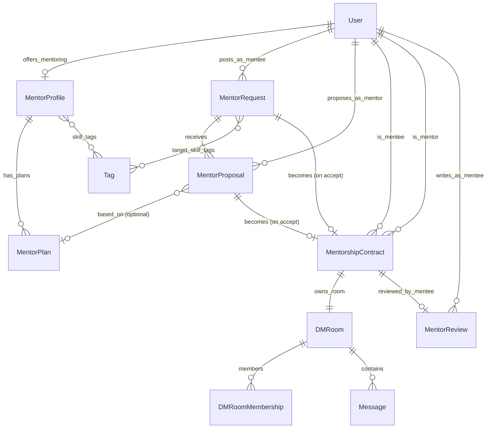

# Phase 11: メンターマッチング (Menta ライク) spec

> Phase 11 全体の design doc。 Menta (https://menta.work/) の feature set を参考に、 既存
> エンジニア SNS (Django + Next.js) に「メンター募集 → 提案 → 契約 → 評価」 の loop を
> 組み込む。
>
> 関連:
>
> - [docs/SPEC.md](../SPEC.md) (既存機能仕様)
> - [docs/ER.md](../ER.md) §2.14 (既存 DM model)
> - [docs/ROADMAP.md](../ROADMAP.md) Phase 11 (要追記)
> - [docs/issues/phase-11.md](../issues/phase-11.md) (本 spec から派生する Issue ドラフト)
> - 文体参考: [article-edit-loop-spec.md](./article-edit-loop-spec.md)
>
> 設計判断サマリ:
>
> 1. 新 app `apps/mentorship/` を作る (User 拡張ではなく独立 app)
> 2. **既存 `apps/dm` を流用** して mentorship thread を実装 (新規 thread model は作らない)
> 3. 課金 (Stripe) は **Phase 11 では未対応**。 model に placeholder field だけ残す
> 4. mentor 申請 / 審査制 **なし**。 誰でも mentee 投稿 + 誰でも mentor 提案できる
> 5. skill taxonomy は **既存 `apps/tags.Tag` 流用**。 新 master 作らない
> 6. 公開 Q&A board は **scope 外** (Phase 12+ 案件)

---

## 1. 背景 / 問題

エンジニア SNS としては Phase 1〜6 で TL / DM / 記事 / 掲示板 / 通知 が出揃ったが、 「学習中の
エンジニアが現役エンジニアに 1 on 1 で教わる」 動線が無い。 Menta のような専門のメンタリング
プラットフォームに流出していた user retention を本サービス内で完結できるようにする。

実装方針は #594 (article-edit-loop) と同流儀:

- 既存 app の蓄積 (DM、 タグ、 通知、 SSR auth gate、 cursor pagination) を流用
- 新規 app `apps/mentorship/` は **mentor 募集 / 提案 / 契約 / 評価** の最小限のみ
- mentor profile は `apps/users.User` の OneToOne ではなく `apps/mentorship.MentorProfile` を
  新規 (User 本体を肥大化させない、 未設定 = mentor offering なし)
- skill 検索は `apps/tags` をそのまま再利用 (新規 master 不要、 distinct table も 1 個減)

---

## 2. やる / やらない

### 2.1 やる (Phase 11 scope)

| sub-phase | 内容                                                                                                     |
| --------- | -------------------------------------------------------------------------------------------------------- |
| 11-A      | mentor 募集 board (mentee が `MentorRequest` を投稿 → mentor が `MentorProposal` を提案 → mentee accept) |
| 11-B      | `MentorProfile` + `MentorPlan` (単発 / 月額) 定義 + `/mentors` 検索                                      |
| 11-C      | 契約成立で `MentorshipContract` 作成 + 既存 `DMRoom (kind=mentorship)` を auto-create                    |
| 11-D      | 契約完了後 `MentorReview` (★5 + comment) — mentee → mentor、 公開                                        |
| 11-F      | skill filter (タグ master 流用、 mentor profile に M2M)                                                  |

### 2.2 やらない (Phase 11 scope 外)

- 11-E **Stripe 課金** (無償ベータ pivot、 future 拡張点だけ残す)
- mentor 申請 / 審査制 (誰でも mentor 提案可、 質は review で淘汰)
- 公開 Q&A board (Menta の機能だが Phase 12+ 案件)
- mentor → mentee の逆方向 review (まず一方向で運用、 双方向は phase 12)
- mentorship thread の archived UI (契約完了で thread は read-only 化のみ、 一覧から消さない)
- mentor の出勤可能時間 schedule UI (Menta の calendar 機能、 phase 12)
- group mentoring (1 mentor : N mentee、 phase 12)

---

## 3. アーキテクチャ

### 3.1 新 app vs 既存 app 拡張

**判断: `apps/mentorship/` を新設**。 理由:

| 案                                                              | pros                                                               | cons                                                                                             |
| --------------------------------------------------------------- | ------------------------------------------------------------------ | ------------------------------------------------------------------------------------------------ |
| `apps/users/` を拡張 (MentorProfile を User の OneToOne で持つ) | model 距離が近い                                                   | User model がさらに肥大、 mentor 機能関連の migration が users に紛れる、 削除時の責任分離が曖昧 |
| `apps/mentorship/` 新設 (本案)                                  | 関心の分離、 mentor 機能だけ削除可能、 phase 11 単独で revert 可能 | model 跨ぎ FK が増える (User、 Tag、 DMRoom)                                                     |

既存も `apps/dm/` `apps/boards/` `apps/articles/` を独立 app にしている前例 (CLAUDE.md §6) と
整合。 また Phase 12 で「公開 Q&A」 を追加する際も `apps/mentorship/` の隣に `apps/qa/` を
増やせる。

### 3.2 DM 流用判断

**判断: 既存 `apps/dm.DMRoom` を流用**。 専用 thread model は作らない。 理由:

| 案                                          | pros                                                       | cons                                                                                                         |
| ------------------------------------------- | ---------------------------------------------------------- | ------------------------------------------------------------------------------------------------------------ |
| `apps/mentorship.MentorshipThread` を新設   | thread と DM の責務が明確、 archive 仕様が独自定義可能     | WebSocket Consumer / 通知 / 添付 / 既読 を全部 reimpl、 frontend も room view を二重実装、 PR 2000+ 行になる |
| `DMRoom.kind` に `mentorship` を追加 (本案) | 既存 Channels / serializer / UI を再利用、 PR 数百行で済む | DMRoom が mentorship contract と直接 FK を持つ、 contract 終了で room を read-only にする UX 追加が必要      |

`DMRoom.kind` choices に `MENTORSHIP = "mentorship"` を追加し、 `MentorshipContract` から
`OneToOneField(DMRoom)` で参照。 既存 DM の Block / Mute / 通知 / S3 添付 がそのまま使える。

mentorship 終了時の UX:

- `MentorshipContract.status = COMPLETED` になると frontend が `is_locked` 相当の UI に切替 (composer 無効化、 「契約完了」 バナー)
- backend では `DMRoom.is_archived = True` をセット (既存 field、 SPEC §7 で archive UI は未実装だが flag は既存)
- read は引き続き可能 (履歴閲覧)

### 3.3 課金 placeholder

**判断: 最初から `MentorPlan.price_jpy` (PositiveIntegerField, default=0) と
`MentorshipContract.is_paid` (BooleanField, default=False) を入れる**。 Phase 11 では
`price_jpy=0` 固定 / `is_paid=False` 固定で運用、 Phase 11-E (将来) で Stripe を入れる際に
field を追加 (`stripe_subscription_id` 等) するだけ。 migration を分割しない狙い。

Stripe 拡張点 (Phase 11-E 用 placeholder):

```python
class MentorPlan(...):
    price_jpy = models.PositiveIntegerField(default=0)  # 0 = 無償ベータ
    billing_cycle = models.CharField(choices=[("one_time", ...), ("monthly", ...)], default="one_time")
    # 将来: stripe_price_id = CharField (Phase 11-E で migration 追加)

class MentorshipContract(...):
    is_paid = models.BooleanField(default=False)  # Phase 11 は常に False
    paid_amount_jpy = models.PositiveIntegerField(default=0)
    # 将来: stripe_subscription_id, stripe_invoice_id (Phase 11-E)
```

### 3.4 ER 図 (mermaid)



---

## 4. データモデル (Django)

新 app `apps/mentorship/`。 既存 `apps/dm/` `apps/tags/` `apps/users/` を import。

### 4.1 MentorProfile

```python
class MentorProfile(TimeStampedModel):
    user = models.OneToOneField(User, on_delete=CASCADE, related_name="mentor_profile")
    headline = models.CharField(max_length=80)  # "AWS infra mentor, ex-SRE"
    bio = models.TextField(max_length=2000)  # Markdown 可
    experience_years = models.PositiveSmallIntegerField()
    is_accepting = models.BooleanField(default=True)  # 一時受付停止フラグ
    skill_tags = models.ManyToManyField("tags.Tag", related_name="mentor_profiles")

    # 検索キャッシュ
    proposal_count = models.PositiveIntegerField(default=0)
    contract_count = models.PositiveIntegerField(default=0)
    avg_rating = models.DecimalField(max_digits=3, decimal_places=2, null=True)
    review_count = models.PositiveIntegerField(default=0)

    class Meta:
        indexes = [
            models.Index(fields=["is_accepting", "-avg_rating"]),
        ]
```

### 4.2 MentorPlan

```python
class MentorPlan(TimeStampedModel):
    class BillingCycle(TextChoices):
        ONE_TIME = "one_time", "単発"
        MONTHLY = "monthly", "月額"

    profile = models.ForeignKey(MentorProfile, on_delete=CASCADE, related_name="plans")
    title = models.CharField(max_length=60)
    description = models.TextField(max_length=1000)
    price_jpy = models.PositiveIntegerField(default=0)  # Phase 11 は 0
    billing_cycle = models.CharField(max_length=20, choices=BillingCycle.choices)
    is_active = models.BooleanField(default=True)

    class Meta:
        indexes = [models.Index(fields=["profile", "is_active"])]
```

### 4.3 MentorRequest (mentee の募集)

```python
class MentorRequest(TimeStampedModel):
    class Status(TextChoices):
        OPEN = "open"           # 募集中
        MATCHED = "matched"     # contract 成立 → これ以上 proposal 受けない
        CLOSED = "closed"       # mentee が手動 close
        EXPIRED = "expired"     # 30 日経過で auto

    mentee = models.ForeignKey(User, on_delete=CASCADE, related_name="mentor_requests")
    title = models.CharField(max_length=80)
    body = models.TextField(max_length=2000)  # 「相談したいこと」
    target_skill_tags = models.ManyToManyField("tags.Tag", related_name="mentor_requests")
    budget_jpy = models.PositiveIntegerField(default=0)  # Phase 11 は 0 推奨
    status = models.CharField(max_length=20, choices=Status.choices, default=Status.OPEN)

    proposal_count = models.PositiveIntegerField(default=0)
    expires_at = models.DateTimeField()  # created_at + 30 days

    class Meta:
        indexes = [
            models.Index(fields=["status", "-created_at"]),
            models.Index(fields=["mentee", "-created_at"]),
        ]
```

### 4.4 MentorProposal (mentor からの提案)

```python
class MentorProposal(TimeStampedModel):
    class Status(TextChoices):
        PENDING = "pending"
        ACCEPTED = "accepted"
        REJECTED = "rejected"
        WITHDRAWN = "withdrawn"  # mentor 自身が取下げ

    request = models.ForeignKey(MentorRequest, on_delete=CASCADE, related_name="proposals")
    mentor = models.ForeignKey(User, on_delete=CASCADE, related_name="proposals_sent")
    body = models.TextField(max_length=2000)  # 提案メッセージ
    plan = models.ForeignKey(MentorPlan, on_delete=SET_NULL, null=True, blank=True)
    status = models.CharField(max_length=20, choices=Status.choices, default=Status.PENDING)
    responded_at = models.DateTimeField(null=True, blank=True)

    class Meta:
        constraints = [
            models.UniqueConstraint(fields=["request", "mentor"], name="unique_request_mentor_proposal"),
        ]
        indexes = [
            models.Index(fields=["request", "status"]),
            models.Index(fields=["mentor", "-created_at"]),
        ]
```

> NOTE: self-proposal の禁止 (`mentor != request.mentee`) は CheckConstraint で書けない (FK 越えの参照)。
> serializer + service 層で validate する (`raise ValidationError` if `request.mentee_id == mentor.pk`)。

### 4.5 MentorshipContract

```python
class MentorshipContract(TimeStampedModel):
    class Status(TextChoices):
        ACTIVE = "active"
        COMPLETED = "completed"
        CANCELED = "canceled"

    proposal = models.OneToOneField(MentorProposal, on_delete=PROTECT, related_name="contract")
    mentee = models.ForeignKey(User, on_delete=CASCADE, related_name="contracts_as_mentee")
    mentor = models.ForeignKey(User, on_delete=CASCADE, related_name="contracts_as_mentor")
    plan_snapshot = models.JSONField()  # 契約時の plan 内容を凍結 (title/price/cycle)
    status = models.CharField(max_length=20, choices=Status.choices, default=Status.ACTIVE)
    room = models.OneToOneField("dm.DMRoom", on_delete=PROTECT, related_name="mentorship_contract")
    started_at = models.DateTimeField(auto_now_add=True)
    completed_at = models.DateTimeField(null=True, blank=True)

    # 課金 placeholder (Phase 11 は常に False/0)
    is_paid = models.BooleanField(default=False)
    paid_amount_jpy = models.PositiveIntegerField(default=0)
    # 将来 (Phase 11-E): stripe_subscription_id, stripe_invoice_id を migration 追加

    class Meta:
        indexes = [
            models.Index(fields=["mentee", "-started_at"]),
            models.Index(fields=["mentor", "-started_at"]),
        ]
```

### 4.6 MentorReview

```python
class MentorReview(TimeStampedModel):
    contract = models.OneToOneField(MentorshipContract, on_delete=CASCADE, related_name="review")
    mentor = models.ForeignKey(User, on_delete=CASCADE, related_name="reviews_received")
    mentee = models.ForeignKey(User, on_delete=SET_NULL, null=True, related_name="reviews_written")
    rating = models.PositiveSmallIntegerField()  # 1〜5
    comment = models.TextField(max_length=2000)
    is_visible = models.BooleanField(default=True)  # 通報対応で隠す用

    class Meta:
        constraints = [
            models.CheckConstraint(check=Q(rating__gte=1, rating__lte=5), name="rating_1_to_5"),
        ]
        indexes = [
            models.Index(fields=["mentor", "-created_at"]),
        ]
```

### 4.7 DMRoom 拡張 (既存 app)

`apps/dm/models.py` の `DMRoom.Kind` に 1 行追加するだけ:

```python
class Kind(models.TextChoices):
    DIRECT = "direct", "1:1"
    GROUP = "group", "group"
    MENTORSHIP = "mentorship", "メンタリング"  # 新規追加
```

frontend `RoomChat` は `kind === 'mentorship'` のとき header に「メンタリング契約中」 バナー

- 完了時 read-only UI を出すだけ。

---

## 5. sub-phase 依存順

```
Phase 6 / 4A 完了 (Tag、 Notification、 SSR auth 既存)
   │
   ├──▶ 11-A: mentor 募集 board (最小 MVP、 単独でリリース可能)
   │     │
   │     ├──▶ 11-F: skill filter (タグ M2M、 検索 query) — 11-A の数日後
   │     │
   │     └──▶ 11-C: contract + DMRoom (kind=mentorship)
   │           │
   │           └──▶ 11-D: MentorReview (★ + comment)
   │
   └──▶ 11-B: MentorProfile + Plan + /mentors 検索 (11-A と並行可能)
         │
         └──▶ (11-C で plan を proposal に紐付け)
```

- **11-A は単独で stg リリース可能**: mentee が募集を出し mentor が提案 (text のみ)、 mentee が
  accept すると新規 DMRoom (kind=direct で OK、 contract model 無し) が作られて DM 開始。
  MVP の MVP。
- 11-B は 11-A と並行できる (MentorProfile は読み取り専用検索のみ、 contract に絡まない)
- 11-C で初めて `MentorshipContract` model が登場 (11-A の DMRoom を upgrade する形)
- 11-D は 11-C の `status=COMPLETED` event が必要 (blocking)
- 11-F は 11-A / 11-B の両方が動いてからでも OK (filter UI だけ後付け可能)

---

## 6. REST API 設計

prefix: `/api/v1/mentor/`。 既存 viewset / cursor pagination / Cookie auth を踏襲。

### 6.1 mentor 募集 (MentorRequest)

| method   | path                           | auth        | 動作                                                        |
| -------- | ------------------------------ | ----------- | ----------------------------------------------------------- |
| `GET`    | `/mentor/requests/`            | **anon 可** | 一覧 (status=open のみ、 cursor pagination、 tag filter 可) |
| `POST`   | `/mentor/requests/`            | auth        | 投稿                                                        |
| `GET`    | `/mentor/requests/<id>/`       | **anon 可** | 詳細 + proposals (proposals は owner のみ可視)              |
| `PATCH`  | `/mentor/requests/<id>/`       | owner       | title/body/target_skill_tags 編集 (status=open のみ)        |
| `DELETE` | `/mentor/requests/<id>/`       | owner       | 論理削除 (status=closed に遷移)                             |
| `POST`   | `/mentor/requests/<id>/close/` | owner       | 手動 close                                                  |

### 6.2 提案 (MentorProposal)

| method | path                                       | auth                      | 動作                                             |
| ------ | ------------------------------------------ | ------------------------- | ------------------------------------------------ |
| `POST` | `/mentor/requests/<request_id>/proposals/` | auth (mentor、 self 不可) | 提案投稿 (1 request に 1 mentor 1 proposal)      |
| `GET`  | `/mentor/requests/<request_id>/proposals/` | request owner のみ        | 提案リスト                                       |
| `GET`  | `/mentor/proposals/me/`                    | auth                      | 自分が出した提案リスト (mentor 視点)             |
| `POST` | `/mentor/proposals/<id>/accept/`           | request.mentee のみ       | accept → MentorshipContract + DMRoom auto-create |
| `POST` | `/mentor/proposals/<id>/reject/`           | request.mentee のみ       | 個別 reject (他 proposal は残る)                 |
| `POST` | `/mentor/proposals/<id>/withdraw/`         | proposal.mentor のみ      | mentor 自身が取下げ                              |

### 6.3 mentor profile / plan / 検索

| method   | path                      | auth        | 動作                                                          |
| -------- | ------------------------- | ----------- | ------------------------------------------------------------- |
| `GET`    | `/mentors/`               | **anon 可** | 検索 (skill_tags / experience_years / is_accepting で filter) |
| `GET`    | `/mentors/<handle>/`      | **anon 可** | mentor profile + 公開 plans + 公開 reviews                    |
| `PATCH`  | `/mentors/me/`            | auth        | 自分の profile 編集 (auto-create if not exists)               |
| `POST`   | `/mentors/me/plans/`      | auth        | plan 追加                                                     |
| `PATCH`  | `/mentors/me/plans/<id>/` | owner       | plan 編集                                                     |
| `DELETE` | `/mentors/me/plans/<id>/` | owner       | plan 論理削除 (is_active=False)                               |

### 6.4 contract / review

| method | path                               | auth                              | 動作                                          |
| ------ | ---------------------------------- | --------------------------------- | --------------------------------------------- |
| `GET`  | `/mentor/contracts/me/`            | auth                              | 自分の契約一覧 (mentee + mentor 両視点を tab) |
| `GET`  | `/mentor/contracts/<id>/`          | auth (mentee or mentor のみ)      | 契約詳細                                      |
| `POST` | `/mentor/contracts/<id>/complete/` | mentee or mentor                  | 契約完了 (status=COMPLETED、 review 可能化)   |
| `POST` | `/mentor/contracts/<id>/cancel/`   | mentee or mentor                  | キャンセル (review 不可)                      |
| `POST` | `/mentor/contracts/<id>/review/`   | mentee のみ (status=COMPLETED 後) | review 投稿 (1 contract 1 review)             |
| `GET`  | `/mentors/<handle>/reviews/`       | **anon 可**                       | 受領 review 一覧                              |

### 6.5 共通

- **anon 閲覧可** な endpoint は SSR で server-side fetch 可 (Cookie 不要)
- **owner only** な endpoint は viewset の `get_permissions` で `IsOwner` を返す
- 通報は既存 `apps/moderation.Report.Target` に `mentor_request` / `mentor_proposal` /
  `mentor_review` を追加 (migration が `apps/moderation` 側で発生)
- Block / Mute は既存 `apps/moderation` がクエリ層で適用される (MentorRequest list で blocker を除外、
  proposal で blockee に送らせない) — Phase 4B と同じパターン

---

## 7. frontend route (Next.js App Router)

すべて `client/src/app/(template)/` 配下。 LeftNav (`leftNavLinks`) に `/mentor/wanted` を追加
(2 click で到達可能にする)。 CLAUDE.md §9 で何度も踏んだ「ホームから到達できない」 反省への対応。

| route                          | SSR auth gate                           | 内容                                                                                     |
| ------------------------------ | --------------------------------------- | ---------------------------------------------------------------------------------------- |
| `/mentor/wanted`               | **anon 可**                             | 募集一覧 (status=open)、 tag filter、 sticky header に「募集を出す」 CTA (auth のみ表示) |
| `/mentor/wanted/new`           | auth (`/login?next=...` redirect)       | mentee 投稿フォーム                                                                      |
| `/mentor/wanted/<id>`          | **anon 可**                             | 募集詳細 + proposals (owner のみ proposal リスト可視)                                    |
| `/mentor/wanted/me`            | auth                                    | 自分の募集一覧 (mentee 視点)                                                             |
| `/mentor/proposals/me`         | auth                                    | 自分の提案一覧 (mentor 視点)                                                             |
| `/mentors`                     | **anon 可**                             | mentor 検索 + skill filter + ranking (avg_rating 降順)                                   |
| `/mentors/<handle>`            | **anon 可**                             | mentor profile (overview / plans / reviews tab)                                          |
| `/mentors/me/edit`             | auth                                    | 自分の MentorProfile + plans 編集                                                        |
| `/mentor/contracts/me`         | auth                                    | 契約一覧 (mentee tab + mentor tab)                                                       |
| `/mentor/contracts/<id>`       | auth (mentee or mentor のみ、 他は 404) | 契約詳細 + 完了 button + review (mentee のみ)                                            |
| `/u/<handle>` (既存ページ拡張) | **anon 可**                             | `?tab=mentor` で MentorProfile を embed (PR #594 と同流儀)                               |

SSR auth gate ルール (PR #606 / article-edit-loop と同じ):

- **anon 可** route は `serverFetch` を `try`、 失敗時 null、 owner check で UI 出し分け
- **auth 必須** route は SSR で `cookies().get("logged_in")` 判定、 false なら `redirect("/login?next=...")`

---

## 8. risk / open question

| #   | risk                                                                             | 対応方針                                                                                                                                                                                   |
| --- | -------------------------------------------------------------------------------- | ------------------------------------------------------------------------------------------------------------------------------------------------------------------------------------------ |
| R1  | 既存 DM 流用で mentorship 終了時の thread を archived にする必要                 | `DMRoom.is_archived=True` を `Contract.complete` で set、 frontend `RoomChat` で kind=mentorship + is_archived の時 composer 無効化バナー出す。 既存 archive flag は使ってないので衝突なし |
| R2  | MentorProfile を User OneToOne か別 model か                                     | **別 model (本案)**。 User 肥大化を避ける、 mentor offering なし = profile レコードなしで判定単純化                                                                                        |
| R3  | skill taxonomy: 既存 Tag M2M で十分か                                            | **既存 Tag 流用 (本案)**。 mentor 検索 / mentee 募集 / 既存ツイートで同じ taxonomy が使えて、 重複入力が消える                                                                             |
| R4  | 課金 placeholder: 最初から field を入れるか migration 追加か                     | **最初から (本案)**。 `price_jpy=0` `is_paid=False` で運用、 Phase 11-E (将来) で field 追加だけ                                                                                           |
| R5  | 公開 Q&A board (Menta の機能) は今回 scope 外か                                  | **scope 外**。 Phase 12+ で `apps/qa/` を別途新設 (掲示板に近いが mentor 連動要素あり)                                                                                                     |
| R6  | mentor 「申請 / 審査制」 を入れるか                                              | **入れない**。 PR #594 で得た身分制限なし MVP 反省を踏襲、 質は MentorReview で淘汰                                                                                                        |
| R7  | proposal の上限 (1 mentee request に何件まで mentor が proposal 可能か)          | **上限なし、 ただし mentee 視点で UI 上 sort + filter で良 mentor が浮き上がるよう ranking**                                                                                               |
| R8  | accept した瞬間に他の proposal を全部 rejected にするか                          | **しない**。 個別 reject か放置 (status=pending のまま) で、 mentee の選択肢を残す。 ただし request.status=MATCHED 後は新規 proposal を受け付けない                                        |
| R9  | Stripe を将来入れる際に MentorshipContract.is_paid を後付け migration するコスト | **placeholder field を最初から入れる**ことで Phase 11-E の migration は新規 stripe\_\* field 追加のみ、 既存 row への back-fill 不要                                                       |
| R10 | mentor の出勤可能時間 / calendar 機能 (Menta にあり) は Phase 11 に入れるか      | **入れない**。 Phase 12 で `MentorAvailability` を別 model で追加検討                                                                                                                      |
| R11 | mentor review の信頼性 (sock puppet 防止)                                        | Phase 11 では「契約完了 mentee のみ書ける」 制限のみ。 Phase 12 で「実在 contract 1 件以上」 等の追加 guard 検討                                                                           |
| R12 | mentee request の expires_at (30 日 auto-expire) は Celery beat 必要             | 既存 `apps/notifications` 用の Celery beat に `mentorship.expire_requests` task を 1 日 1 回追加                                                                                           |

---

## 9. テスト戦略

### 9.1 backend pytest (Python)

- model: 各 model の constraint (unique、 check)、 status 遷移 (open → matched / rejected)
- service: `accept_proposal()` で `MentorshipContract` + `DMRoom` が atomically 作成、 既に accept 済なら冪等
- API: viewset の permission (anon GET、 owner only PATCH / DELETE / accept、 他人 proposal 不可視)
- block / mute: Phase 4B と同じ流儀で `qs_visible_for(viewer)` を migrate query layer に挟む
- coverage 80%+ (common/testing.md 準拠)

### 9.2 frontend vitest

- MentorRequestCard / MentorProposalForm / MentorReviewForm の component 単体
- accept button の状態遷移 (pending → accepted で button disable)

### 9.3 Playwright stg E2E (`client/e2e/mentor-board.spec.ts` 等)

CLAUDE.md §4.5 step 6 / [e2e-stg.md](../local/e2e-stg.md) に従って stg 第一選択。

シナリオ (5 本最低):

1. **mentor 募集の golden path**: test2 が `/mentor/wanted/new` で投稿 → test3 が `/mentor/wanted/<id>` で proposal → test2 が accept → 両者の `/messages` に新規 room (kind=mentorship) が登場 → message 送れる
2. **anon 閲覧可**: 匿名 user が `/mentor/wanted` / `/mentors` / `/mentors/<handle>` を踏んでも 200
3. **owner only**: test3 が test2 の `/mentor/wanted/<id>` の `/proposals/` を見ても自分の提案だけ可視 (test2 の他 mentor からの proposal は見えない)
4. **review flow**: 契約完了 button → mentee review (★5 + comment) → mentor profile に reflect (avg_rating 更新)
5. **skill filter**: `/mentor/wanted?tag=python` で python tagged 募集のみ表示、 `/mentors?tag=aws` で aws skill mentor のみ表示

### 9.4 gan-evaluator

CLAUDE.md §4.2 マトリクスに従い、 frontend 新ルート (`/mentor/wanted` `/mentors`) は
**`gan-evaluator` agent 必須**。 「ホームから 3 click 以内で到達できるか」 「未ログインで壊れないか」
「契約完了の終わりシグナルが画面上にあるか」 を採点。

---

## 10. CLAUDE.md §4.5 step 6 完了チェックリスト (Phase 11 全体)

- [ ] Playwright spec (`client/e2e/mentor-board.spec.ts` + `mentor-review.spec.ts`) を書いた
- [ ] テストシナリオを本 spec doc §9.3 に書いた + Playwright 実行コマンド明記
- [ ] ホーム → 3 click 以内で `/mentor/wanted` に到達 (LeftNav に link 追加で 1 click)
- [ ] 未ログイン / 他人で踏んでも壊れない (anon 可 route の確認、 owner only の 404 隠蔽)
- [ ] 画面上に「契約成立 / 完了」 シグナル (DM room 遷移 toast / 契約詳細「完了済」 バッジ / review 投稿後 mentor profile 反映)
- [ ] 第一選択 stg Playwright (URL は `https://stg.codeplace.me`、 env は [e2e-stg.md](../local/e2e-stg.md))
- [ ] frontend ルート追加なので `gan-evaluator` agent を必須呼出 (CLAUDE.md §4.2)
