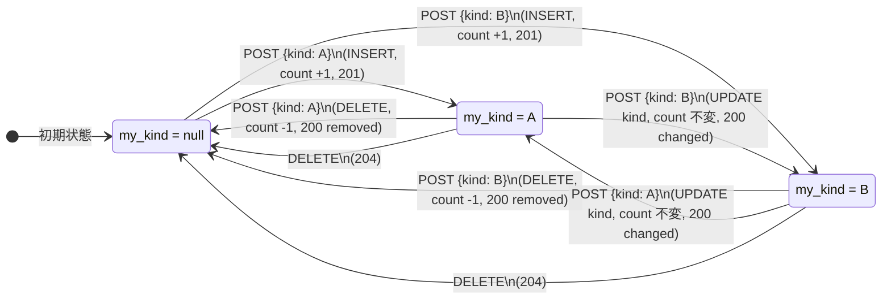

# リアクション機能 仕様書

> Version: 0.1
> 最終更新: 2026-05-05
> ステータス: 実装済み (Phase 2 P2-04 / #179, P2-14 / #187 完了済み)
> 関連: [SPEC.md §6](../SPEC.md), [ER.md §2.9](../ER.md), [reactions-scenarios.md](./reactions-scenarios.md), [reactions-e2e-commands.md](./reactions-e2e-commands.md)

---

## 0. このドキュメントの位置づけ

本プロジェクトの **リアクション (Reaction)** 機能の **UI 上の挙動** と **DB / API の状態遷移** を仕様として固定する。`docs/SPEC.md §6` は機能の存在と 10 種絵文字の表しか触れていないので、トグル方向 / 種別変更 / Block 連動 / カウンタ整合 / Tombstone の挙動など細部を本書で確定させる。

**ゴール**: 「1 user × 1 tweet = 0 もしくは 1 種類の reaction」 を不変条件として、UI / API / DB / 通知のすべてのレイヤで一貫させる。X 本家の Like を 10 種に拡張した独自仕様。

---

## 1. 用語

| 用語               | 定義                                                                                                        |
| ------------------ | ----------------------------------------------------------------------------------------------------------- |
| 元 tweet           | reaction の対象となる Tweet 行 (`Tweet`)。`type` は問わない (`original` / `reply` / `quote` 等いずれでも可) |
| reaction           | `Reaction` モデル 1 行。`(user, tweet, kind)` の三つ組                                                      |
| kind               | リアクションの種類。10 種固定 (§2.1)                                                                        |
| my_kind (動詞状態) | あるユーザが対象 tweet について **保有している reaction の kind**。0 種なら `null`、1 種なら kind 値        |
| reaction_count     | `Tweet.reaction_count`。当該 tweet に紐づく Reaction 行の総数 (kind を問わない)                             |

**ユーザ視点の状態は単一スカラ `my_kind ∈ {null} ∪ KINDS` で表現する**。同一 (user, tweet) ペアに対して複数 kind を持てない (DB レベルで `UniqueConstraint(user, tweet)` で保証)。

---

## 2. 仕様

### 2.1 絵文字セット (10 種固定)

`SPEC.md §6.2` および `apps/reactions/models.py::ReactionKind` を正本とする。

| key           | 絵文字 | label        |
| ------------- | ------ | ------------ |
| `like`        | ❤️     | いいね       |
| `interesting` | 💡     | 面白い       |
| `learned`     | 📚     | 勉強になった |
| `helpful`     | 🙏     | 助かった     |
| `agree`       | 👍     | わかる       |
| `surprised`   | 😲     | びっくり     |
| `congrats`    | 🎉     | おめでとう   |
| `respect`     | 🫡     | リスペクト   |
| `funny`       | 😂     | 笑った       |
| `code`        | 💻     | コードよき   |

要点:

- ネガティブ系 (Bad / Dislike / 反対) は **意図的に追加しない** (SPEC §6.2 確定)。
- フロント表示は `client/src/lib/api/reactions.ts::REACTION_META` を正本とし、emoji + label の対応はバックエンド (`ReactionKind.choices`) と完全一致する。
- 種類の追加・削除は migration を伴う。frontend の `REACTION_KINDS` 配列とバックエンドの `ReactionKind` を **必ず同時に変更** する (片側変更すると CHOICES 検証で 400 になる)。

### 2.2 1 user × 1 tweet × 0/1 reaction の不変条件

DB:

- `apps/reactions/models.py::Reaction.Meta.constraints` に `UniqueConstraint(fields=["user", "tweet"], name="unique_user_tweet_reaction")`。
- kind は constraint に **含めない**。種別変更を `UPDATE 1 件` で表現するため (DELETE + CREATE しない / arch H-1)。

API:

- 同じ kind の重複 INSERT は 200 (`changed=False, removed=False`) として idempotent に処理。
- 別の kind を後押下した場合は **既存行の kind を UPDATE する** だけで `Reaction` の id・`created_at` は変わらない。

UI:

- ReactionBar は同時に 1 つの `aria-pressed=true` ボタンしか持てない (`my_kind` ベース)。
- 別 kind を押下したら、Optimistic update で「旧 kind の count を -1, 新 kind を +1, my_kind を新 kind に」即座に反映する。

### 2.3 トグル仕様 (upsert)

`POST /api/v1/tweets/<id>/reactions/` body=`{kind: <K>}` の振る舞いは「現状の `my_kind`」で決まる。`apps/reactions/views.py::ReactionView.post` が正本。

| 現状態 (`my_kind`) | リクエスト kind | 副作用                                   | レスポンス例                                                   | HTTP |
| ------------------ | --------------- | ---------------------------------------- | -------------------------------------------------------------- | ---- |
| `null` (なし)      | `K`             | INSERT `(user, tweet, K)`, count +1      | `{kind: "K", created: true,  changed: false, removed: false}`  | 201  |
| `K`                | `K`             | DELETE 自分の Reaction, count -1         | `{kind: null, created: false, changed: false, removed: true}`  | 200  |
| `K1`               | `K2` (≠ K1)     | UPDATE kind を K2 に. count 変化なし     | `{kind: "K2", created: false, changed: true,  removed: false}` | 200  |
| `null`             | `K` (race)      | INSERT が IntegrityError → 既存を UPDATE | `{kind: "K", created: false, changed: false, removed: false}`  | 200  |

要点:

- 「同じ kind の再押下 = 取消」は X の Like トグル踏襲。確認ダイアログ無し。
- 「別 kind 押下 = 種類変更」は内部的に **`UPDATE Reaction SET kind = ?` 1 文** だけで処理し、`reaction_count` は変えない (signals が `created=False` のとき何もしない / `apps/reactions/signals.py::on_reaction_saved`)。
- 同時 INSERT race は `IntegrityError` を catch して既存行を UPDATE する path で吸収 (idempotent)。

### 2.4 明示的取消 (DELETE)

`DELETE /api/v1/tweets/<id>/reactions/` (body 不要) は actor 自身の Reaction を削除する。

- 既存あり → DELETE → count -1, **204 No Content**。
- 既存なし → **404 Not Found** (`{detail: "リアクションがありません。"}`)。
- 認証必須 (未ログインは 401)。

POST のトグル経路と機能的に重複するが、UI が「現在の kind が分からない状態でとにかく取り消したい」とき (例: 別タブで変更した結果が反映されてない場合) に使えるよう残す。

### 2.5 集計取得 (GET)

`GET /api/v1/tweets/<id>/reactions/` は AllowAny (未ログインも可)。

レスポンス形:

```json
{
	"counts": {
		"like": 12,
		"interesting": 3,
		"learned": 0,
		"helpful": 0,
		"agree": 1,
		"surprised": 0,
		"congrats": 0,
		"respect": 0,
		"funny": 0,
		"code": 0
	},
	"my_kind": "like"
}
```

要点:

- `counts` は **必ず 10 kind 全部** を含む (0 のものも 0 で埋める)。フロントが `counts[kind] ?? 0` の null 判定をしなくても KeyError しないように。
- `my_kind` は認証時のみ。未ログインは `null`。
- `Tweet.reaction_count` (denormalized counter) と `sum(counts.values())` は signals + reconcile Beat で整合。reconcile は日次。

### 2.6 Block / 削除 tweet との関連

`apps/reactions/views.py::ReactionView.post` の事前チェック:

| 状況                                      | レスポンス                                               |
| ----------------------------------------- | -------------------------------------------------------- |
| 元 tweet が `is_deleted=True`             | 404 (default Manager で除外、`get_object_or_404` 経由)   |
| actor と tweet author が双方向 block 関係 | 403 `{detail: "このツイートにリアクションできません。"}` |
| 認証なし                                  | 401                                                      |
| kind が 10 種以外                         | 400 (DRF ChoiceField validation)                         |

要点:

- Block は **どちらか片方が block** していれば成立 (`is_blocked_relationship` は対称) → A が B を block しても、B が A を block しても、B は A の tweet にリアクション不可。
- 既存 reaction が後から block 関係になった場合: 既存 reaction 行は **そのまま残る** (= count に乗ったまま)。`SPEC §11 (Block)` と整合させる。一括取消は別 issue。

### 2.7 Rate limit

DRF `ScopedRateThrottle` で `throttle_scope = "reaction"`。`config/settings/base.py::_THROTTLE_RATES_BASE`:

| 環境 | rate                    |
| ---- | ----------------------- |
| 本番 | `60/min`                |
| stg  | `600/min` (`#336` 緩和) |

429 のときは `Retry-After` header を返す (DRF default)。フロントは toast でユーザに知らせる。

### 2.8 通知連動 (Phase 4A 以降)

`signals.py::on_reaction_saved` 内で `apps.common.blocking.safe_notify(kind="LIKE", recipient=tweet.author, actor=instance.user)` を `transaction.on_commit` 経由で呼ぶ。Phase 4A (`apps/notifications/`) 完成までは no-op (`safe_notify` は通知 app が無ければ silent skip)。

要点:

- 通知 kind は `LIKE` 固定 (10 種を区別しない、`SPEC §8 通知` の方針)。
- 通知文言は通知側で決める (例: 「@{actor} があなたのツイートにリアクションしました (❤️)」)。
- 自分自身の tweet への self-reaction は **通知しない** (= notify 内で actor == recipient なら skip。Phase 4A で実装)。

### 2.9 カウンタ整合 (drift 防止)

SoT: `Reaction` 行の集計。`Tweet.reaction_count` は denormalized cache。

- `signals.on_reaction_saved` が新規作成時のみ `+1`、kind 変更時は触らない。
- `signals.on_reaction_deleted` が `-1` (`Greatest(F('reaction_count') - 1, 0)` で 0 でクリップ)。
- `apps/reactions/tasks.reconcile_reaction_counters` が日次 Beat で `Tweet.reaction_count = COUNT(Reaction WHERE tweet=?)` で再計算 (drift 補正)。

drift が発生する経路:

- `transaction.on_commit` で signal を発行する間に DB rollback / replica lag。
- `Reaction.objects.bulk_create / bulk_delete` (signals が発火しない) → **MVP では bulk 操作禁止**。

---

## 3. 状態遷移図

ある (actor, target_tweet) ペアの `my_kind` の遷移。kind は 10 種だが図示の都合で 2 種 (`A`, `B`) に縮約。



要点:

- ノード数は (10 + 1) = 11、辺数はオーダ 10² だが、構造は完全グラフ (NONE は中心ハブ、各 kind 間も直接遷移)。
- 「再押下 = 取消」「別押下 = 種類変更」「明示 DELETE = NONE 戻し」の 3 系統のみ。

---

## 4. 条件分岐表 (action × current state × constraint)

### 4.1 ReactionBar UI 描画

`#381` で **Facebook 風 UX** に変更。trigger は単一の "👍 (Good)" ボタンとして表示し、click は **常に like トグル**、長押しで picker を開く。別 kind に変えたい場合は長押しから選ぶ。

| 状態           | trigger 表示                     | aria-pressed | aria-label                                    |
| -------------- | -------------------------------- | ------------ | --------------------------------------------- |
| `my_kind=null` | `👍 {total}` (灰色)              | `false`      | `いいね (長押しで他のリアクション)`           |
| `my_kind=K`    | `{emoji(K)} {total}` (lime 強調) | `true`       | `{label(K)}を取消 (長押しで他のリアクション)` |

picker 内の grid (`role="group"`) は #379 で確定済の挙動を維持:

- 全 10 kind ボタン (灰色 hover、選択中は lime-500/20 強調)
- `aria-pressed=true` は my_kind に一致する kind のみ
- `busyKind !== null` の間は disabled

要点:

- `total` は `sum(counts)` で 10 kind 合算 (X の Like 数表示踏襲)。
- trigger ボタンは **1 つ**。click / Enter で quick toggle、長押し / Alt+Enter で picker。
- a11y: trigger は `aria-haspopup="true"`, `aria-expanded={open}`, `aria-pressed={my_kind!==null}`。

#### 4.1.1 操作と判定 (#381)

| 操作                                    | 動作                                                                           |
| --------------------------------------- | ------------------------------------------------------------------------------ |
| click / tap (短押し, < `LONG_PRESS_MS`) | quick toggle: `my_kind=null` → POST `like`、それ以外 → POST `my_kind` (= 取消) |
| 長押し (>= `LONG_PRESS_MS=500ms`)       | picker を開く (`setOpen(true)`)                                                |
| picker 内 kind click                    | 既存挙動: kind を反映して popup close (#379, #187)                             |
| Enter キー                              | quick toggle (= click と同じ。button が自動で click 発火)                      |
| `Alt+Enter` キー                        | picker 開閉 (キーボード代替、長押しの a11y alternative)                        |
| Escape                                  | popup close (#379)                                                             |
| outside click                           | popup close (#379)                                                             |

長押し判定の実装:

- `pointerdown` (button=0 のときのみ) で `setTimeout(LONG_PRESS_MS=500)` を開始、`longPressFiredRef.current=false`
- timer 満了で `longPressFiredRef.current=true` + `setOpen(true)`
- `pointerup` / `pointercancel` / `pointerleave` で timer 解除
- 続く `click` イベントで `longPressFiredRef.current === true` なら quick toggle を **suppress** し、ref を false にリセット
- jsdom (test 環境) では `e.button` が undefined になるため、guard は `typeof e.button === "number" && e.button !== 0` (production の real browser のみ右 click を抑制)

#### 4.1.2 popup の開閉 (#379, 既存)

| トリガ                               | 振る舞い                                           |
| ------------------------------------ | -------------------------------------------------- |
| 長押し / Alt+Enter                   | popup を open                                      |
| grid 内 kind 押下                    | popup を **即時 close** + Optimistic update + POST |
| popup 外領域 (document) を mousedown | popup を **close**                                 |
| `Escape` キー                        | popup を **close**                                 |

要点:

- 「kind 押下 → 即時 close」は X / Slack / Discord 等の絵文字 picker 慣習。API 結果を待たずに閉じる (optimistic update と組で UX 即時化、失敗時は state ロールバック)。
- outside click / Escape は WAI-ARIA Authoring Practices の `aria-haspopup` パターン準拠。
- 実装は `useEffect` 内で `open === true` のときだけ `document.mousedown` / `document.keydown` listener を登録、cleanup で解除。container 内 mousedown は `containerRef.current.contains(target)` で判定して除外する。

### 4.2 各 action の遷移と副作用

| 現状態 (`my_kind`)  | action                        | 結果状態 (`my_kind`) | API                                         | counts                   | 備考                                                     |
| ------------------- | ----------------------------- | -------------------- | ------------------------------------------- | ------------------------ | -------------------------------------------------------- |
| `null`              | grid で K を click            | `K`                  | `POST /tweets/<id>/reactions/` `{kind: K}`  | `K +1, total +1`         | 201 created                                              |
| `K`                 | grid で K を click (再押下)   | `null`               | `POST /tweets/<id>/reactions/` `{kind: K}`  | `K -1, total -1`         | 200 removed=true                                         |
| `K1`                | grid で K2 を click (別 kind) | `K2`                 | `POST /tweets/<id>/reactions/` `{kind: K2}` | `K1 -1, K2 +1, total ±0` | 200 changed=true. UPDATE 1 文                            |
| `K`                 | DELETE エンドポイント         | `null`               | `DELETE /tweets/<id>/reactions/`            | `K -1, total -1`         | 204 No Content                                           |
| `null`              | DELETE エンドポイント         | `null`               | `DELETE /tweets/<id>/reactions/`            | 不変                     | 404 (既存なし)                                           |
| 元 tweet が削除済み | POST or DELETE                | -                    | -                                           | -                        | 404. UI 側でも tombstone カードに ReactionBar を出さない |
| 双方向 block 関係   | POST                          | -                    | -                                           | -                        | 403 `このツイートにリアクションできません。`             |
| Rate limit 超過     | POST                          | -                    | -                                           | -                        | 429 + `Retry-After`. UI は toast 表示                    |
| 認証なし            | POST or DELETE                | -                    | -                                           | -                        | 401. UI は LoginCTA を表示                               |
| 未ログイン          | GET                           | -                    | `GET /tweets/<id>/reactions/`               | counts のみ              | `my_kind=null`                                           |

---

## 5. 実装対応方針

### 5.1 バックエンド

- `Reaction` モデルは `(user, tweet, kind)` 三つ組 + `created_at, updated_at`。`UniqueConstraint(user, tweet)`。
- view は **POST upsert / DELETE 明示 / GET 集計** の 3 verb のみ。`PUT/PATCH` は提供しない (POST upsert で兼ねる)。
- POST は `select_for_update` で同一 (user, tweet) の行をロックしてから既存判定 → INSERT / DELETE / UPDATE 分岐。
- IntegrityError は同時 race の保険として `existing` を再 fetch + UPDATE で吸収。
- counts 集計は GET 内で `Counter(values_list("kind"))`、10 kind を 0 で埋めて返す。
- Block チェックは `apps.common.blocking.is_blocked_relationship`。
- 削除済み tweet は default Manager で除外、`get_object_or_404` で 404。
- Rate limit は `ScopedRateThrottle` の `reaction` スコープ。stg は 10x 緩和 (#336)。

### 5.2 フロントエンド

- `ReactionBar` は trigger button + 開閉式 grid。trigger の `aria-expanded` で grid 状態を表現。
- Click は **Optimistic update**: count と my_kind を即時反映、API レスポンス到着で my_kind だけ server 値で reconcile。
- API 失敗時は previous state にロールバック + `react-toastify` で通知。
- grid 内 button は 10 kind 分。`aria-pressed=true` で現在の kind を示す。
- Alt+Enter で grid 開閉 (キーボード代替)。
- 削除済み tweet (tombstone) のカードは ReactionBar を **render しない**。
- 未ログインで POST すると 401 → トースト + ログイン CTA。GET は AllowAny なので counts のみ表示し、grid を開いた瞬間にログイン required の placeholder を出す (現実装は trigger を押せる、実際の API 401 時に toast)。

### 5.3 通知

- Phase 4A の `apps/notifications/` 実装後に `safe_notify(kind="LIKE", ...)` が稼働。
- 種別 (10 種) は通知に乗せない設計。「@user がリアクションしました」のみ。
- self-reaction は通知しない。
- 通知 throttling は通知側の責務 (短時間連続 react は 1 通知に集約、SPEC §8.4)。

### 5.4 カウンタ drift 補正

- 日次 Celery Beat `apps.reactions.tasks.reconcile_reaction_counters` が全 Tweet をバッチで集計し直す。
- 差分があった行のみ UPDATE。Sentry にメトリクス送出 (drift 件数)。
- DB 直叩き / bulk_create / DML migration 後のずれ救済が主目的。

---

## 6. 参考

### 内部参照

- [docs/SPEC.md §6](../SPEC.md) (リアクション仕様)
- [docs/ER.md §2.9](../ER.md) (Reaction モデル)
- [apps/reactions/models.py](../../apps/reactions/models.py)
- [apps/reactions/views.py](../../apps/reactions/views.py)
- [apps/reactions/serializers.py](../../apps/reactions/serializers.py)
- [apps/reactions/signals.py](../../apps/reactions/signals.py)
- [apps/reactions/tasks.py](../../apps/reactions/tasks.py)
- [apps/reactions/tests/test_reaction_api.py](../../apps/reactions/tests/test_reaction_api.py)
- [client/src/components/reactions/ReactionBar.tsx](../../client/src/components/reactions/ReactionBar.tsx)
- [client/src/lib/api/reactions.ts](../../client/src/lib/api/reactions.ts)

### 関連 Issue / PR

- P2-04 (#179): apps/reactions モデル + API
- P2-14 (#187): リアクション UI (10 種 + Alt+Enter)
- P2-21 (#193): E2E (golden path)
- #336: stg rate limit 緩和

### 関連ドキュメント

- [reactions-scenarios.md](./reactions-scenarios.md) — 日本語シナリオ集
- [reactions-e2e-commands.md](./reactions-e2e-commands.md) — E2E 実行コマンド
