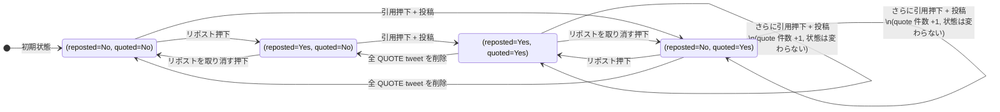

# リポスト / 引用ツイート 状態遷移仕様

> Version: 0.2 (Draft)
> 最終更新: 2026-05-04
> ステータス: Draft (実装着手前 / X 本家挙動の実機確認込みで FIX 予定)
> 関連: [SPEC.md §3.3 / §3.4](../SPEC.md), [ER.md §2.5](../ER.md), [ROADMAP.md](../ROADMAP.md)
>
> **0.2 での変更**: ユーザー指摘 3 点を反映。(1) §2.1 / §4.1 のアイコン色は `reposted` 軸のみ依存で `quoted` 軸は色に影響しないことを明記。(2) §2.5 を全面書き直し、tombstone 時の TL レンダリングを type 別の表で整理し、placeholder 文言 (英: "This post is unavailable" / 日: 「このポストは表示できません」) を確認。(3) §2.1 表に「`quoted` 軸はメニューに影響しない」を 1 行追加し、§5.x に本プロジェクト実装側の整合チェックを追記。

---

## 0. このドキュメントの位置づけ

本プロジェクトのリポスト (Repost) と 引用ツイート (Quote) の **UI 上の挙動** と **DB / API の状態遷移** を、X (旧 Twitter) 本家の現挙動 (2024〜2026 時点) と整合させるための仕様書。

`docs/SPEC.md` §3.3 / §3.4 は機能の存在と件数カウントしか触れていないため、ボタンメニューの内容・トグル方向・引用と repost の併用可否といった細部を本書で確定させる。

**ゴール**: 「X でできること / できないこと」をそのまま再現する。独自のひねりは入れない (差別化は別レイヤーで行う方針、ROADMAP 参照)。

---

## 1. 用語

| 用語                | 定義                                                                                              |
| ------------------- | ------------------------------------------------------------------------------------------------- |
| 元 tweet            | 「リポスト」ボタンが押される対象のツイート。`Tweet`                                               |
| REPOST tweet        | `type=repost` の Tweet 行。`body=""`、`repost_of` で元 tweet を指す                               |
| QUOTE tweet         | `type=quote` の Tweet 行。本文 1〜180 字 + `quote_of` で元 tweet を指す                           |
| reposted (動詞状態) | あるユーザが対象 tweet について **REPOST tweet を保有している** 状態                              |
| quoted (動詞状態)   | あるユーザが対象 tweet を **少なくとも 1 件 quote している** 状態 (生きてる QUOTE tweet が 1+ 件) |

**ユーザ視点の状態は (reposted, quoted) の 2 軸のフラグ** で表現する。両者は独立 (X 本家がそうなっている、§3 参照)。

---

## 2. X 本家の現挙動 (調査結果)

`help.x.com` 公式ヘルプ + 解説記事 (TweetDelete / Tweet Archivist / Circleboom / Android Police 等、2024〜2026 時点) を参照した。出典は §6。

### 2.1 リポスト ボタン押下時のメニュー

メニュー項目は **`reposted` 軸** だけで決まる。**`quoted` 軸は影響しない** (引用済みでもメニューは「リポスト or 引用」のままで、特別な「引用を取り消す」項目は出ない)。

| 現状態 (`reposted`, `quoted`) | 開くポップアップ メニュー                         |
| ----------------------------- | ------------------------------------------------- |
| `(No,  No)`                   | `[ リポスト ] [ 引用 ]`                           |
| `(No,  Yes)`                  | `[ リポスト ] [ 引用 ]` (No,No と同じ)            |
| `(Yes, No)`                   | `[ リポストを取り消す ] [ 引用 ]`                 |
| `(Yes, Yes)`                  | `[ リポストを取り消す ] [ 引用 ]` (Yes,No と同じ) |

要点:

- **「引用」項目はどちらの状態でも常に出る**。引用は「もう 1 件追加で Quote を作る」操作なので、既に repost 済みでも、既に引用済みでも独立して何件でも追加できる (§2.3 参照)。
- 「引用を取り消す」というメニュー項目は **存在しない**。引用ツイートの削除は通常の tweet 削除メニュー (`...` メニュー → 削除) からのみ行う。
- **「引用」項目を選択したら、このリポストメニューは閉じる**。引用は別の作成画面 / dialog を開く操作なので、リポストメニューと引用作成 dialog を同時表示してはいけない。実装上は menu close を先に確定させ、その直後に quote composer を開く。
- iOS / Android / Web で UI 細部 (BottomSheet vs Dropdown) は違うが、出る項目とラベルは同じ。
- アイコン色は §4.1 を参照。**色も `reposted` 軸のみで決まり、`quoted` の有無では変わらない** (X 本家の現挙動、2024〜2026 時点)。

### 2.2 「リポストを取り消す」の挙動

- メニューから「リポストを取り消す」を選ぶと **即時** に REPOST tweet が消える。**確認ダイアログは出ない** (X はワンタップで取消)。
- 元 tweet の `repost_count` は 1 減る。
- 取り消した後、フォロワーの TL から該当 RT 行が消える (キャッシュの絡みで他端末では遅延あり、と公式 FAQ にも記載)。
- 取り消し後に同じ tweet をもう一度リポストすることは可能 (制限なし)。`repost_count` は再び +1 される。

### 2.3 引用ツイートの挙動

- 「引用」を選ぶと作成画面が開き、本文 (X は最大 280 字、本プロジェクトは 180 字) を入力して投稿する。
- 引用は **通常の tweet と同等** に扱われる。取り消し UI は無く、削除は自分のツイート一覧の「削除」メニューから行う (= QUOTE tweet を soft-delete)。
- **引用は何件でも作れる**。同一の元 tweet に対して同じユーザが quote を 3 回作っても、3 件とも別の QUOTE tweet になる。`quote_count` も +3 される。
- repost との **同時併存可** : `(reposted, quoted) = (True, True)` の状態が成立する。X はこの 2 軸を独立に管理している。

### 2.4 REPOST tweet 自体に対する操作

- REPOST tweet (= 自分が他人をリポストした行) は TL 上で **元 tweet 本体が表示** され、上部に「@user がリポストしました」バナーが付く。
- このカードの下にある「リポスト」ボタンを押すと、**操作対象は元 tweet** になる (バナー部分はリポスト不可)。
  - 例: A が B のツイートをリポスト → C が A の TL でその行を見て「リポスト」を押す → C の REPOST は B の元 tweet を指す (`repost_of=B's_tweet`)。A が間に入ることはない。
  - 引用も同様 (`quote_of=B's_tweet`)。
- これにより「RT の RT」のチェーンは生まれず、`repost_of` は常に深さ 1 の参照に保たれる。

### 2.5 削除済み (tombstone) tweet — 元 tweet 削除時の TL 表示

X 本家では「元 tweet を含む派生 tweet」(REPOST / QUOTE / REPLY) ごとに TL での見え方が違う。`type` 別に整理する。

| 派生 tweet の `type` | 元 tweet 削除後の TL 表示                                                                                                            | 派生本文 (引用者コメント / リプライ本文) | DB 上の派生 tweet 自体                                                            |
| -------------------- | ------------------------------------------------------------------------------------------------------------------------------------ | ---------------------------------------- | --------------------------------------------------------------------------------- |
| `REPOST`             | **行ごと TL から消える**。「@user がリポストしました」バナー + 元 tweet 本体の組で 1 行になっているので、本体が消えると行ごと消滅。  | (本文無し)                               | X 内部では soft-delete 同等。本プロジェクトでは alive のままだが render 時 filter |
| `QUOTE`              | **引用者の本文は残る**。元 tweet が表示されていた埋め込みカード部分が placeholder に差し替わる。                                     | 残る                                     | alive のまま                                                                      |
| `REPLY`              | **リプライ本文は残る**。会話ツリー上、親 tweet の位置に placeholder が出る (X はリプライツリーの構造を保つため tombstone を立てる)。 | 残る                                     | alive のまま                                                                      |

**Placeholder の文言** (X 公式 UI、2024〜2026 時点で確認):

- 英語版: `This post is unavailable` (一部、削除以外の理由 — 凍結 / 鍵垢化 / ブロック / withheld 等 — でも同文言)
- 日本語版: 「このポストは表示できません」 (英語版に追従)
- 旧 Twitter 期 (2023 以前) は `This Tweet is unavailable` / 「このツイートは表示できません」だったが、リブランド後は `post` 表記に統一

要点:

- 削除理由の分岐 (deleted / suspended / protected / withheld / blocked) は **placeholder 文言ではほぼ区別できない**。X は意図的に汎用化している。出典: 公式 dev community discussion (§6 参照)。
- 元 tweet の **新規 リポスト / 引用 は不可**: ボタンが disabled、または操作時に 400 エラー。
- 鍵垢 (protected) ツイートも repost 不可 (本プロジェクトは MVP では鍵垢機能を持たないので、この分岐は将来用)。
- **本プロジェクトでの実装方針** (§5.4 参照): 元 tweet が `is_deleted=True` のとき、DB から派生 tweet 自体を削除はせず、render 層で type 別に分岐する。
  - REPOST → TL serializer で除外 (`exclude(repost_of__is_deleted=True)` 相当の filter)。クライアントには出さない
  - QUOTE → 派生 tweet は返す。`quote_of` を埋め込まず `quote_of_unavailable=True` のフラグを立て、フロント側で placeholder カードを描画
  - REPLY → 同様。`reply_to` 解決時に削除済みなら placeholder 表示
- これにより X 互換の見え方を再現しつつ、DB 上の不可視削除 (`is_deleted=True`) が他の派生に伝播するのを避ける (cascade hard-delete を避ける = §5.4 で詳述)。

### 2.6 カウント整合性

| イベント                    | `repost_count` | `quote_count` |
| --------------------------- | -------------- | ------------- |
| 新規 REPOST tweet 作成      | +1             | -             |
| REPOST tweet 取り消し       | -1             | -             |
| 同一 user による 2 回目 RT  | (拒否)         | -             |
| 新規 QUOTE tweet 作成       | -              | +1            |
| QUOTE tweet 削除 (soft)     | -              | -1            |
| 同一 user による N 件 quote | -              | +N            |

「同一 user による 2 回目 RT」が拒否されるのは X / 本プロジェクト共通の制約。本プロジェクトでは partial UniqueConstraint `tweet_unique_repost_per_user` (apps/tweets/models.py) で DB レイヤから保証している。

---

## 3. 状態遷移図 (Mermaid)

ある (actor, target_tweet) ペアに対する状態と user action の関係を図示する。`reposted` と `quoted` は独立フラグなので、状態は 4 つの直積で表現する。

ポイント:

- **`quoted=Yes` は「QUOTE tweet を 1 件以上保有」の集約フラグ** であって、何件あっても 1 つの状態として扱う。引用を 5 件作っても状態としては `quoted=Yes` のまま、ただし `quote_count` は +5。
- リポスト軸は完全な ON/OFF トグル、引用軸は「count 操作」 + 「最後の 1 件を消したら状態が変わる」非対称構造。

---

## 4. 条件分岐表 (action × current state)

UI 側のボタンメニュー描画と enabled/disabled、API 側の振る舞いを 1 表にまとめる。

凡例:

- `RT▶ rev` : 「リポストを取り消す」を表示
- `RT▶ new` : 「リポスト」(新規) を表示
- `Q▶` : 「引用」を表示

### 4.1 リポストアイコン押下時のメニュー (元 tweet が alive のとき)

| 現状態                     | メニュー項目       | アイコン色                |
| -------------------------- | ------------------ | ------------------------- |
| `(reposted=No,  quoted=*)` | `RT▶ new` + `Q▶` | 灰色 (default)            |
| `(reposted=Yes, quoted=*)` | `RT▶ rev` + `Q▶` | 緑 (active, lime-600/400) |

**`quoted` の値はメニュー項目にもアイコン色にも影響しない**。X 本家でも `quoted=Yes` (= 自分が引用済み) でアイコンは緑にならず、灰色のまま (`reposted` 軸が `No` であれば)。これは X が「引用は『もう 1 件 tweet を作る』 = 何件でも作れる操作」として ON/OFF トグルではなく『+1 操作』として扱っているためで、`reposted` のような ON/OFF 状態とはモデルが違う (§3 状態遷移図参照)。

`Q▶` を選択したときは、リポストメニューを閉じてから quote composer を開く。`RT▶ new` / `RT▶ rev` はメニュー内で完結する操作だが、`Q▶` は別 surface に遷移する操作なので、menu と composer の二重ポップアップ状態を禁止する。

出典: TweetDelete / Domino blog ほか複数ソースで「retweet 時に icon が緑になる」「取り消すと灰色に戻る」と一貫して書かれており、quote 時に icon 色が変わるという記述はどこにも無い (§6 参照)。本プロジェクトもこれに合わせる。

### 4.2 各 action の遷移と副作用

**表記ルール — 状態ベクトル `(reposted, quoted)`:**

各行の「現状態」「結果状態」列は **ある actor (操作している自分) と target tweet (操作対象のツイート) のペアに対する状態の 2 軸ベクトル**。§1 の用語定義をそのまま使う。

- 1 軸目 `reposted` — 自分がこの tweet を **既にリポストしているか**
  - `Yes` = 自分の REPOST tweet が DB に存在する (`type=repost`, `repost_of=target`, `author=self`)
  - `No` = まだ存在しない、または取り消し済み
- 2 軸目 `quoted` — 自分がこの tweet を **既に少なくとも 1 件引用しているか**
  - `Yes` = 自分の QUOTE tweet が 1 件以上 alive (`type=quote`, `quote_of=target`, `author=self`)
  - `No` = 一度も作っていない、または全て削除済み

たとえば `(Yes, No)` は「自分はこの tweet をリポスト中、引用はまだ 0 件」を表す。`(No, Yes)` は「リポストはしてない、でも引用は 1 件以上ある」。リポスト軸と引用軸は独立 (§3 状態遷移図参照) なので、4 状態すべてが取りうる。

| 現状態 `(reposted, quoted)` | action                             | 結果状態 `(reposted, quoted)`    | API                                         | counts    | 備考                                  |
| --------------------------- | ---------------------------------- | -------------------------------- | ------------------------------------------- | --------- | ------------------------------------- |
| `(No,  No)`                 | リポスト押下                       | `(Yes, No)`                      | `POST /tweets/<id>/repost/`                 | repost +1 | -                                     |
| `(No,  No)`                 | 引用押下 + 投稿                    | `(No,  Yes)`                     | `POST /tweets/<id>/quote/`                  | quote +1  | 入力 dialog を経由                    |
| `(Yes, No)`                 | リポストを取り消す                 | `(No,  No)`                      | `DELETE /tweets/<id>/repost/`               | repost -1 | 確認ダイアログなし (X 同等)           |
| `(Yes, No)`                 | 引用押下 + 投稿                    | `(Yes, Yes)`                     | `POST /tweets/<id>/quote/`                  | quote +1  | 既存 REPOST tweet は **そのまま残る** |
| `(No,  Yes)`                | リポスト押下                       | `(Yes, Yes)`                     | `POST /tweets/<id>/repost/`                 | repost +1 | 既存 QUOTE tweet 群は そのまま残る    |
| `(No,  Yes)`                | 引用押下 + 投稿                    | `(No,  Yes)`                     | `POST /tweets/<id>/quote/`                  | quote +1  | 状態不変、件数のみ加算                |
| `(Yes, Yes)`                | リポストを取り消す                 | `(No,  Yes)`                     | `DELETE /tweets/<id>/repost/`               | repost -1 | QUOTE 群は無関係                      |
| `(Yes, Yes)`                | 引用押下 + 投稿                    | `(Yes, Yes)`                     | `POST /tweets/<id>/quote/`                  | quote +1  | 状態不変、件数のみ加算                |
| 任意 + `quoted=Yes`         | QUOTE tweet を `DELETE /tweets/N/` | quote -1, 0 になれば `quoted=No` | `DELETE /tweets/<quote_id>/` (soft)         | quote -1  | 現状 SPEC §3.9 の soft-delete         |
| 元 tweet が `is_deleted`    | リポスト押下 / 引用押下            | (拒否)                           | 400 `tweet is deleted` または UI で disable | -         | tombstone は repost / quote 不可      |

### 4.3 REPOST tweet 自身を起点に押した場合

REPOST tweet (自分または他人の `type=repost` 行) のカード上の「リポスト」「引用」ボタンを押した場合、`target` は **元 tweet** (`repost_of`) に解決する。actor は元 tweet に対する `(reposted, quoted)` 状態に従って §4.1 / §4.2 のフローを実行する。

REPOST tweet を直接 target にする repost / quote は仕様上禁止。サーバ側で `target.type == REPOST` なら `target = target.repost_of` に解決し直すか、UI で REPOST tweet の id を投げないようにする (現状実装の `TweetCard.tsx` は `repost_of.id` を辿って詳細遷移しているため、ボタンも同様に解決すれば整合する)。

---

## 5. 実装対応方針

この章は進捗管理ではなく、実装が満たすべき恒常的な対応関係だけを書く。

### 5.1 バックエンド

- `Tweet.type` は `original` / `reply` / `repost` / `quote` の 4 種。
- REPOST tweet は `body=""`、`repost_of` で元 tweet を指す。
- QUOTE tweet は本文を持ち、`quote_of` で元 tweet を指す。
- 同一 user x 同一元 tweet の REPOST は 1 件だけ許可する。
- QUOTE は同一 user x 同一元 tweet で何件でも作成できる。
- `POST /api/v1/tweets/<id>/repost/` は idempotent に REPOST tweet を作成する。
- `DELETE /api/v1/tweets/<id>/repost/` は actor 自身の REPOST tweet を削除する。
- `POST /api/v1/tweets/<id>/quote/` は新しい QUOTE tweet を作成する。
- `DELETE /api/v1/tweets/<id>/` は対象 tweet を soft-delete する。
- 操作対象に REPOST tweet の id が渡された場合は、サーバ側で `repost_of` の元 tweet に解決してから処理する。これにより REPOST のチェーンを作らない。
- 削除済み tweet は新規 repost / quote / reply の対象にしない。

### 5.2 フロントエンド

- リポストボタンは直接 toggle せず、メニューを開く。
- `reposted=No` のとき、メニューは `[リポスト] [引用]`。
- `reposted=Yes` のとき、メニューは `[リポストを取り消す] [引用]`。
- `quoted` の有無はメニュー項目とアイコン色に影響しない。
- `引用` を選択したらリポストメニューを閉じてから quote composer を開く。
- REPOST tweet のカードでアクションする場合、操作対象は表示されている元 tweet。
- 自分の通常 tweet / quote / reply は、tweet メニューから削除できる。
- 自分の REPOST tweet は、リポストメニューの `リポストを取り消す` で削除する。

### 5.3 Tombstone 表示

- 元 tweet が削除された REPOST tweet は TL から除外する。
- 元 tweet が削除された QUOTE tweet は、引用者本文を残し、埋め込み元 tweet 部分を placeholder にする。
- 元 tweet が削除された REPLY tweet は、リプライ本文を残し、親 tweet 部分を placeholder にする。
- placeholder 文言は削除理由を区別しない。

---

## 6. 参考 URL

調査時の出典 (2026-05 時点で最新挙動を確認)。X 本家ヘルプは IP ブロックで WebFetch 不可だったが、検索結果で要点は引けている。

### 一次ソース (公式)

- [help.x.com — How to Repost](https://help.x.com/en/using-x/how-to-repost)
- [help.x.com — Repost FAQs](https://help.x.com/en/using-x/repost-faqs)

### 二次ソース (解説記事 / 2024〜2026)

- [TweetDelete — Undo Repost on X](https://tweetdelete.net/resources/undo-repost-on-x/)
- [TweetDelete — How to Delete a Repost on X](https://tweetdelete.net/resources/how-to-delete-a-repost-on-x/)
- [TweetDelete — Twitter Symbols (icon color reference)](https://tweetdelete.net/resources/twitter-symbols/)
- [Tweet Archivist — How to Quote Tweet on X in 2026](https://www.tweetarchivist.com/how-to-quote-tweet-guide)
- [Circleboom — How to Undo Repost on X (Twitter) in 2026](https://circleboom.com/blog/how-to-undo-repost-on-x-twitter/)
- [Circleboom — Retweet button greyed out](https://circleboom.com/blog/retweet-button-greyed-out/)
- [Android Police — How to delete a repost on X](https://www.androidpolice.com/x-delete-a-post/)
- [TweetEraser — How To Delete a Repost on X](https://www.tweeteraser.com/resources/how-to-delete-a-repost-on-x-undo-retweets-easily/)
- [Domino — How to Retweet on X Like a Pro (icon color)](https://domino.run/blog/how-to-retweet)
- [TweetEraser — Twitter Quote Tweet Removed](https://www.tweeteraser.com/resources/twitter-quote-tweet-removed-what-it-means-for-users/)

### v0.2 追加: 削除済み tweet / placeholder 関連

- [Social Media Today — Twitter Changed the Way Tweet Embeds Look When the Source Tweet Has Been Removed](https://www.socialmediatoday.com/news/twitters-changed-the-way-tweet-embeds-look-when-the-source-tweet-has-been/621716/)
- [SocialRails — "This Tweet Is Unavailable" — What It Means & How to Fix It](https://socialrails.com/blog/this-tweet-is-unavailable-fix) (placeholder 文言「This post is unavailable」確認元)
- [howtodotechystuff — "This post is unavailable" notice on Twitter / X (June 2024)](https://howtodotechystuff.wordpress.com/2024/06/30/this-post-is-unavailable-notice-on-twitter-x-two-potential-solutions/)
- [X Developers community — Causes of "This Tweet is unavailable. Learn more"](https://devcommunity.x.com/t/causes-of-this-tweet-is-unavailable-learn-more/158159) (削除 / 凍結 / 鍵垢 / withheld / block を文言で区別しないことの一次出典)
- [Stefan Judis — Twitter started to mess with embedded content on your site](https://www.stefanjudis.com/notes/twitter-started-to-mess-with-embedded-content-on-your-site/)
- [kuro-mame — X (旧 Twitter) のリポストとは](https://kuromame9510.com/x-repost/) (日本語版 placeholder 文言「このポストは表示できません」確認元)

### 内部参照

- [docs/SPEC.md §3.2-§3.4](../SPEC.md)
- [docs/ER.md §2.5 (Tweet)](../ER.md)
- [apps/tweets/models.py](../../apps/tweets/models.py) (Tweet, TweetType)
- [apps/tweets/views_actions.py](../../apps/tweets/views_actions.py) (RepostView, QuoteView)
- [client/src/components/tweets/RepostButton.tsx](../../client/src/components/tweets/RepostButton.tsx)
- [client/src/components/timeline/TweetCard.tsx](../../client/src/components/timeline/TweetCard.tsx)
